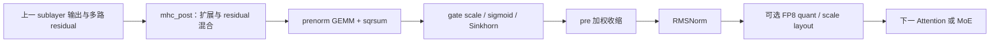

# mHC PR 进展与 kernel 现状（2026-09-11）

> 查询窗口：2026-09-11 17:38–17:44，Asia/Shanghai。统计覆盖 28 个公开仓库、266 个去重 PR：143 MERGED、67 OPEN、56 CLOSED（未合入）。包含 mHC 算子、框架接入、训练实现、正确性修复、warmup，以及直接依赖/替代 PR；不是对全 GitHub、私有仓库和个人 fork 的穷举。完整状态、目标分支及原始标题见 [PR 索引](mhc-pr-index-20260911.md)。本轮是 GitHub/API 与源码核查，没有重新运行 GPU benchmark。

## 1. 当前最值得关注的结论

1. **DeepGEMM Mega-mHC 已进入 upstream `main`，但主流 serving 接入尚未完成。** [DeepGEMM #432](https://github.com/deepseek-ai/DeepGEMM/pull/432) 于 9 月 10 日合入；新算子融合 post/pre、mix 计算、Sinkhorn、RMSNorm，并支持可选 FP8 输出。PR 报告 45–85% speedup，不能当成模型吞吐增幅。当前实现要求架构主版本为 10，因此 **H20/H100/H200 不在这个 Mega-mHC 的支持范围**。
2. **SGLang 已具备完整的传统 mHC 优化路径。** DeepGEMM prenorm、TileLang big-fuse、RMSNorm、head、post+pre 都已有实现；[FlashInfer 接入 #33616](https://github.com/sgl-project/sglang/pull/33616) 也已在 8 月 7 日合入。全局 post+pre 融合在 [#35214](https://github.com/sgl-project/sglang/pull/35214) 默认开启；FlashInfer backend 当前仍默认关闭。
3. **vLLM 的近期增量集中在 Mega-mHC、head fusion、CuTeDSL 和 warmup。** [#56255](https://github.com/vllm-project/vllm/pull/56255) 只把 Mega-mHC 接到 DSv4.1，engram 路径继续回退；PR 临时切换 DeepGEMM 到 upstream main，因此移除了该依赖的 SM120 支持。它尚未合入。CuTeDSL [#48619](https://github.com/vllm-project/vllm/pull/48619) 也仍开放、存在冲突。
4. **TRT-LLM 已有自己的 FMA/MMA、多 tactic、两 kernel/单 kernel 融合体系。** 最近值得跟进的是已合入的 half-MMA 优化 [#16799](https://github.com/NVIDIA/TensorRT-LLM/pull/16799) 和 all-in-one coherence/uneven split-K 修复 [#18331](https://github.com/NVIDIA/TensorRT-LLM/pull/18331)，不能把它等同于新 DeepGEMM Mega-mHC API。
5. **AMD 的 AITER fused post+pre + RMSNorm 已被 SGLang/vLLM 消费。** 更新的 packed BF16 hi/lo [AITER #5412](https://github.com/ROCm/aiter/pull/5412) 和 [ATOM #2195](https://github.com/ROCm/ATOM/pull/2195) 仍开放；新 DSv4.1 TileLang wave64 修复与接入 [vLLM #56342](https://github.com/vllm-project/vllm/pull/56342) 也仍开放。
6. **OPEN、MERGED 与“当前主线是否具备该能力”必须分开。** SGLang [#38952](https://github.com/sgl-project/sglang/pull/38952) 已合入的是 `dsv4.1`；[#34021](https://github.com/sgl-project/sglang/pull/34021) 虽仍开放，但当前 main 已使用 [#35118](https://github.com/sgl-project/sglang/pull/35118) 的 Triton combine，原 PR 描述的 eager 临时张量路径已被替代。

## 2. kernel 到底融合到了哪里

以普通 mHC 的相邻 sublayer 边界为例，逻辑工作是：

这里的 `hc_head` 是最后的多路 residual 收缩路径，和上述跨层 post+pre 融合不是同一处。不同实现还可能带 shifted mHC、engram、MTP/DSpark 和通信边界，不能只按函数名判断融合范围。

| 实现 | 已有 kernel / 融合范围 | 硬件与边界 | 框架消费状态 |
| --- | --- | --- | --- |
| DeepGEMM 传统 prenorm | `tf32_hc_prenorm_gemm` 同时计算小 N GEMM 与平方和，支持 split-K；不包含完整 Sinkhorn/post/pre | upstream `main`：SM90、SM10x；输入 BF16，权重与输出 FP32。SM120 实现在 `nv_dev` / SGL fork `dev` | SGLang、vLLM 传统 CUDA 路径已有消费 |
| DeepGEMM **Mega-mHC** | post、prenorm/mix、Sinkhorn、pre、RMSNorm 单 kernel；normal/shifted 模式；BF16/FP8 可选输出 | `arch_major == 10`；`hc_mult=4`；`H` 为 1024 的正倍数；`T≤2^20`；FP8 granularity=32，UE8M0 打包 | upstream 已合入；SGL fork 同步 #86 为 draft；vLLM #56255 待合入 |
| SGLang TileLang | standalone pre/post、big-fuse+norm、head；小 M 把 post+prenorm 合并，再运行 big-fuse | 当前 `fma_token_threshold=32`；大 M 仍走 post + GEMM + big-fuse；禁用 DeepGEMM 的 fallback 有待优化 PR | `main` 已接入，post+pre 全局默认开启；实际使用还受设备和模型 dispatch 条件约束 |
| vLLM TileLang | standalone pre/post、big-fuse+norm、head、post+pre；有 broadcast/delayed 变体 | 当前 fused post+pre 的小 FMA 阈值为 `M≤16`；大 M 保留分阶段计算 | `main` 已接入；Mega-mHC/CuTeDSL/新增尾部 fusion 仍在 PR |
| FlashInfer CUDA | `mhc_post`、`mhc_pre_big_fuse`、`mhc_pre_big_fuse_with_prenorm` | `HC=4`；big-fuse 接收 GEMM 结果，with-prenorm 补平方和/归一化，并不替代投影 GEMM；没有完整 post+pre API | SGLang #33616 已接；组合为 DeepGEMM GEMM + FlashInfer big-fuse/post，额外 norm 由框架处理 |
| TRT-LLM CUDA | `mhc_fused_hc`：half-FMA、all-FMA、half-MMA、all-MMA；支持 norm fusion、autotune | MMA 要求 `100≤SM<110` 且构建启用相应支持，MMA 的 H 为 4096/7168；其余情况选择合法 FMA tactic | `main` 已有原生模块和模型接入 |
| ROCm AITER HIP/Triton | pre GEMM+sqrsum、big-fuse+RMSNorm、post+pre、AllReduce+post；不同设备分派 HIP/Triton | 需区分 gfx942/gfx95x wave64 与 gfx12xx wave32；新 BF16 hi/lo 方案未合入 | SGLang #32577、vLLM #52737 已接 fused flow |
| TileKernels / TileOPs / TileLang examples | 分解式 pre/post、Sinkhorn、projection/aggregate；TileKernels 还提供训练 backward/recompute | 是算子/训练参考能力，不能自动等同于 serving 已接入 | 多条已公开；TileKernels 部分修复和 TileLang ROCm 示例修复仍开放 |
| TransformerEngine / Megatron | TE Triton fused projection/mix/aggregate；Megatron optional Triton/cuTile + native fallback | 训练、梯度和 recompute 路线，需要分别核实 `main` / `dev` | TE 已合入；Megatron `main` 已有 core mHC 与 HybridModel fused 支持 |
| XPU / TPU / Ascend | SYCL、Pallas、AscendC/TileLang-Ascend 等独立实现 | 算子已实现不代表所有模型/后端组合可用 | XPU、TPU 有已合入能力；Ascend 当前多条模型接入和 fused-op PR 仍开放 |

主要源码依据：

- [hyperconnection.hpp:45](https://github.com/deepseek-ai/DeepGEMM/blob/66081d4c9c7d7c44f13fea402e5b622aa0f409c2/csrc/apis/hyperconnection.hpp#L45)：传统 prenorm 的架构 dispatch。
- [mega_mhc.hpp:42](https://github.com/deepseek-ai/DeepGEMM/blob/66081d4c9c7d7c44f13fea402e5b622aa0f409c2/csrc/apis/mega_mhc.hpp#L42)、[mega_mhc.hpp:137](https://github.com/deepseek-ai/DeepGEMM/blob/66081d4c9c7d7c44f13fea402e5b622aa0f409c2/csrc/apis/mega_mhc.hpp#L137)、[mega_mhc.cuh:10](https://github.com/deepseek-ai/DeepGEMM/blob/66081d4c9c7d7c44f13fea402e5b622aa0f409c2/deep_gemm/include/deep_gemm/layout/mega_mhc.cuh#L10)：Mega API、shape、dtype 与常量。
- [mhc.py:1508](https://github.com/sgl-project/sglang/blob/822e73ccddc0297e9901042d4aab7fcccc11f1a6/python/sglang/kernels/ops/layernorm/mhc.py#L1508)、[mhc.py:1591](https://github.com/sgl-project/sglang/blob/822e73ccddc0297e9901042d4aab7fcccc11f1a6/python/sglang/kernels/ops/layernorm/mhc.py#L1591)：SGLang 融合边界和阈值；[tilelang.py:704](https://github.com/vllm-project/vllm/blob/8c1d1c2974ee42757ee2e93cc898932edfd9d265/vllm/model_executor/kernels/mhc/tilelang.py#L704)：vLLM 分派。
- [mhc.py:176](https://github.com/flashinfer-ai/flashinfer/blob/ac7bce13ea0ff76392fd17aa696b096e191d0825/flashinfer/mhc.py#L176)、[mhc.py:334](https://github.com/flashinfer-ai/flashinfer/blob/ac7bce13ea0ff76392fd17aa696b096e191d0825/flashinfer/mhc.py#L334)：FlashInfer big-fuse API。
- [mhc_cuda.py:37](https://github.com/NVIDIA/TensorRT-LLM/blob/31b47b67ebed549b9784a0791b8fdc8035d789f0/tensorrt_llm/_torch/modules/mhc/mhc_cuda.py#L37)、[mhc_cuda.py:530](https://github.com/NVIDIA/TensorRT-LLM/blob/31b47b67ebed549b9784a0791b8fdc8035d789f0/tensorrt_llm/_torch/modules/mhc/mhc_cuda.py#L530)：TRT-LLM 架构与 MMA shape gate。

## 3. NVIDIA serving 的 PR 主线

### DeepGEMM 与 SGL fork

| PR | 当前状态 | 进展 / 尚缺什么 |
| --- | --- | --- |
| [DeepGEMM #432](https://github.com/deepseek-ai/DeepGEMM/pull/432) | MERGED → `main`，09-10 | 发布 Mega-mHC，并引入 DeepJIT 和默认非 deterministic 的全局行为；需要 batch-invariant 的调用方应审查 `use_deterministic_algorithms()` 设置 |
| [SGL DeepGEMM #86](https://github.com/sgl-project/DeepGEMM/pull/86) | OPEN、draft、MERGEABLE/CLEAN → `dev` | 合并 26/09 upstream、保留 SGL FFI/wheel 与下游架构。作者已记录 H200/B200/B300 大量正确性验证，包含 mHC graph replay/barrier、scale-view capacity 修正；整包仍有 sparse/varlen 性能问题，尚未 ready。没有公开 checks，不能把 CLEAN 当成验收通过 |
| [DeepGEMM #376](https://github.com/deepseek-ai/DeepGEMM/pull/376) | OPEN、CLEAN | HyperConnection NVRTC 编译修复；不是新的融合算子 |
| [DeepGEMM #319](https://github.com/deepseek-ai/DeepGEMM/pull/319) | CLOSED，未合入 | 早期 SM120 prenorm 提案。当前 `nv_dev` 和 SGL `dev` 源码已有 SM120 文件，但 upstream `main` 的 API 仍只 dispatch SM90/SM10x；不能依据旧 PR 的关闭状态推断整个生态无 SM120 能力 |

Mega-mHC 的 graph 使用还有一个具体条件：每个 stream 的 barrier buffer 必须在 capture 前完成首次初始化。默认模式会动态选择 split-K，deterministic 模式固定为 16；两种设置需要分开比较性能和数值。[mega_mhc.hpp:15](https://github.com/deepseek-ai/DeepGEMM/blob/66081d4c9c7d7c44f13fea402e5b622aa0f409c2/csrc/apis/mega_mhc.hpp#L15)

### SGLang

| PR / 链路 | 当前状态 | 已交付或正在处理的能力 |
| --- | --- | --- |
| [#23882](https://github.com/sgl-project/sglang/pull/23882)、[#24438](https://github.com/sgl-project/sglang/pull/24438)、[#24775](https://github.com/sgl-project/sglang/pull/24775) | 已合入 `main` | DSV4 初始接入、split-K/DeepGEMM prenorm、big-fuse norm 与 fused head |
| [#25976](https://github.com/sgl-project/sglang/pull/25976) → [#34019](https://github.com/sgl-project/sglang/pull/34019) → [#35214](https://github.com/sgl-project/sglang/pull/35214) | 已合入 `main` | post+pre kernel → SM12x 默认开启 → 全局默认开启；分别为 05-30、08-14、08-18 |
| [#33616](https://github.com/sgl-project/sglang/pull/33616) | MERGED → `main`，08-07 | FlashInfer backend 已接入。作者明确称当时 TileLang fusion 更快，FI 是替代 backend |
| [#25810](https://github.com/sgl-project/sglang/pull/25810)、[#26238](https://github.com/sgl-project/sglang/pull/26238)、[#27986](https://github.com/sgl-project/sglang/pull/27986)、[#29988](https://github.com/sgl-project/sglang/pull/29988)、[#30741](https://github.com/sgl-project/sglang/pull/30741) | 已合入 `main` | token-count bucket、prenorm wrapper、启动/权重加载预热与 rank 同步、post 预热；这是一条逐步完善的启动 JIT 路线 |
| [#35118](https://github.com/sgl-project/sglang/pull/35118) | MERGED → `main`，09-01 | 将 torch prenorm combine 改为 Triton，直接输出 `[M,H]`，去掉 `[M,HC,H]` 临时乘积 |
| [#38475](https://github.com/sgl-project/sglang/pull/38475) | OPEN、CONFLICTING | DeepGEMM 关闭时，让 fused_post_pre 的中 batch fallback 复用 standalone pre 的 split-K。当前 main 仍保留普通 GEMM fallback，问题可从 dispatch 确认 |
| [#29740](https://github.com/sgl-project/sglang/pull/29740)、[#38442](https://github.com/sgl-project/sglang/pull/38442) | 均 OPEN；#38442 BLOCKED/需 review | 修复独立开启 HC-prenorm、关闭 JIT DeepGEMM 时的 import/NameError；#38442 补充回归覆盖。两条是同一问题的重叠方案 |
| [#37168](https://github.com/sgl-project/sglang/pull/37168) | OPEN、CONFLICTING | 保留 full CUDA graph 捕获的 MHC/DSA tensor owner，避免地址复用；作者有 SM120 验证，仍需解决冲突并在最新代码重验 |
| [#34021](https://github.com/sgl-project/sglang/pull/34021) | OPEN、CONFLICTING；已有替代路径 | 原修复针对 eager combine 的 symmetric-pool 临时张量；当前 main 使用 #35118 的 `hc_combine`，不再是原 eager 表达式。此项应做关闭/重验整理，不能直接列作主线未修复 blocker |
| [#32220](https://github.com/sgl-project/sglang/pull/32220)、[#32497](https://github.com/sgl-project/sglang/pull/32497) | 均 OPEN | MTP draft / draft-extend 的 hc_head capture-time compile；有重叠，需要结合当前 NextN 路径收敛 |
| [#38952](https://github.com/sgl-project/sglang/pull/38952) | MERGED → **`dsv4.1`**，09-10 UTC | 给 `hc_split_sinkhorn` 增加零 token early-return，修复 H200 DP attention idle rank 的零 grid launch；父模型 PR [#38798](https://github.com/sgl-project/sglang/pull/38798) 仍 OPEN |

当前全局默认值是 `SGLANG_OPT_DEEPGEMM_HC_PRENORM=True`、`SGLANG_OPT_FUSE_MHC_POST_PRE=True`、`SGLANG_OPT_USE_FLASHINFER_MHC=False`；server/device/model 仍会施加额外 gate。[environ.py:1438](https://github.com/sgl-project/sglang/blob/822e73ccddc0297e9901042d4aab7fcccc11f1a6/python/sglang/srt/environ.py#L1438)

combine 替代关系已核查 main：[deepseek_v4.py:2152](https://github.com/sgl-project/sglang/blob/822e73ccddc0297e9901042d4aab7fcccc11f1a6/python/sglang/srt/models/deepseek_v4.py#L2152) 调用 [mhc.py:2030](https://github.com/sgl-project/sglang/blob/822e73ccddc0297e9901042d4aab7fcccc11f1a6/python/sglang/kernels/ops/layernorm/mhc.py#L2030)，后者只分配最终输出并调用 Triton kernel。这是源码判断，不是 PR 已关闭的声明。

### vLLM

| PR / 链路 | 当前状态 | 进展 / 限制 |
| --- | --- | --- |
| [#41536](https://github.com/vllm-project/vllm/pull/41536)、[#43437](https://github.com/vllm-project/vllm/pull/43437)、[#43474](https://github.com/vllm-project/vllm/pull/43474) | 已合入 `main` | post+pre、post 的 vectorized copy、pre big-fuse+RMSNorm |
| [#44692](https://github.com/vllm-project/vllm/pull/44692)、[#49429](https://github.com/vllm-project/vllm/pull/49429) | 已合入 `main` | 修复非 4096 hidden 的 fused norm miscompile、block-M prenorm 跨行 reduction carry-over |
| [#56255](https://github.com/vllm-project/vllm/pull/56255) | OPEN、MERGEABLE/UNSTABLE | DSv4.1 Mega-mHC；engram fallback；临时失去依赖侧 SM120 支持。当前失败项是 pre-commit，不能据此推断数值测试失败；PR 给出 GB300 TP4 GSM8K，未给成对 E2E 提速 |
| [#48619](https://github.com/vllm-project/vllm/pull/48619) | OPEN、CONFLICTING、REVIEW_REQUIRED | CuTeDSL 移植 SM100 prenorm GEMM。已有历史人工批准，但当前 aggregate review 仍需处理，DCO 为 ACTION_REQUIRED。作者保留 DeepGEMM 默认，E2E 基本持平 |
| [#51244](https://github.com/vllm-project/vllm/pull/51244) | OPEN、BLOCKED、REVIEW_REQUIRED | post+head、post+head+RMSNorm、post+mean 三个 TileLang 尾部 fusion；有 8×H20 的小幅 E2E 改善报告 |
| [#52725](https://github.com/vllm-project/vllm/pull/52725) | OPEN、draft、BLOCKED | norm fusion 候选；正文的 purpose/test/result 未填，当前不能给出成熟度或性能结论 |
| [#55573](https://github.com/vllm-project/vllm/pull/55573) | OPEN | prefill 先 gather 所需 logits rows，再执行 hc_head+norm。大倍率是 head-tail 局部工作减少；E2E TTFT 在噪声内，性能数据来自内部 v0.28 fork，当前 upstream v0.29 GPU 重验待补 |
| [#42735](https://github.com/vllm-project/vllm/pull/42735) | OPEN、CONFLICTING | prenorm TileLang BF16 shared staging 优化，尚未合入 |
| [#50178](https://github.com/vllm-project/vllm/pull/50178) | OPEN、APPROVED，但 CONFLICTING | 将 mHC TileLang 纳入共享 warmup contract；前置 [#49315](https://github.com/vllm-project/vllm/pull/49315) 已合入，当前仍需解决冲突/失败 check |
| [#51802](https://github.com/vllm-project/vllm/pull/51802)、[#52941](https://github.com/vllm-project/vllm/pull/52941)、[#49707](https://github.com/vllm-project/vllm/pull/49707) | 均 OPEN | NVIDIA 直调 TileLang 的 warmup 覆盖。#51802 接续已关闭 #47807，采用 registry/dispatch 派生 key；#52941 是重叠实现。不能把这些 PR 的收益累加 |
| [#50645](https://github.com/vllm-project/vllm/pull/50645)、[#53055](https://github.com/vllm-project/vllm/pull/53055) | 均 OPEN | broadcast pre 的 DeepGEMM support guard/fallback。当前源码 broadcast 路径仍无普通 pre 已有的 support gate |
| [#53972](https://github.com/vllm-project/vllm/pull/53972) | OPEN、CONFLICTING | DSpark broadcast pre 优化；需结合上面的 fallback 与 warmup 修复一起评估 |

vLLM 的整体 runtime zero-JIT 跟踪仍未完成，[#49349](https://github.com/vllm-project/vllm/issues/49349) 当前依然把 #50178 列为未完成。不能由“已有 warmup.py”推出 NVIDIA 直调、DSpark、MTP 和 fallback 全部预热到位。

### FlashInfer 与 TRT-LLM

| 仓库 / PR | 当前状态 | 进展 |
| --- | --- | --- |
| [FlashInfer #3285](https://github.com/flashinfer-ai/flashinfer/pull/3285) | MERGED → `main`，05-29 | post mapping、pre big-fuse 基础能力；当前 API 中仍没有完整的 fused post+pre 或投影 GEMM |
| [FlashInfer #3460](https://github.com/flashinfer-ai/flashinfer/pull/3460) | OPEN、MERGEABLE/BLOCKED、REVIEW_REQUIRED | H100/SM90 优化：去 96-byte spill、Sinkhorn 与 reduction 重叠。可见 checks 为 2 success，但未完成人工合入要求；性能验证仅 H100 |
| [FlashInfer #4071](https://github.com/flashinfer-ai/flashinfer/pull/4071) | OPEN | 将 b12x CuTeDSL corpus 移入 experimental SM12x，包含 norm/mhc；仍是提案，不属于当前主线已交付能力 |
| [TRT-LLM #13892](https://github.com/NVIDIA/TensorRT-LLM/pull/13892)、[#14329](https://github.com/NVIDIA/TensorRT-LLM/pull/14329)、[#14458](https://github.com/NVIDIA/TensorRT-LLM/pull/14458)、[#14675](https://github.com/NVIDIA/TensorRT-LLM/pull/14675) | 已合入 **`feat/deepseek_v4`** | 早期 fused HC/norm、tactic 缩减、distributed tuning 及禁用不安全 parallel tuning；历史分支合入不能直接写成当时 main 已可用 |
| [TRT-LLM #15379](https://github.com/NVIDIA/TensorRT-LLM/pull/15379)、[#15414](https://github.com/NVIDIA/TensorRT-LLM/pull/15414) | 已合入 `main` | mHC primitives 与 DSV4 模型/集成落地主线 |
| [TRT-LLM #16221](https://github.com/NVIDIA/TensorRT-LLM/pull/16221) | MERGED → `main`，07-13 | 修复 fused mHC output reuse / graph 相关问题；早期 #16175/#16176 均 CLOSED 未合入 |
| [TRT-LLM #16799](https://github.com/NVIDIA/TensorRT-LLM/pull/16799) | MERGED → `main`，07-27；正文后续更新 | Blackwell half-MMA packed FP32x2、loop/reuse 和 TMA store 优化；当前 PR benchmark 报告完整 op 含 BigFuse |
| [TRT-LLM #18331](https://github.com/NVIDIA/TensorRT-LLM/pull/18331) | MERGED → `main`，09-02 UTC | 修复 all-MMA 非一致 reload、TMA global write drain 与 acquire fence；额外 53/106 split 的调度只对 SM107 启用 |

## 4. AMD、XPU、TPU、Ascend 与训练路线

| 路线 | 已合入的关键进展 | 仍开放的关键项 |
| --- | --- | --- |
| AITER HIP | [#2136](https://github.com/ROCm/aiter/pull/2136) pre、[#2479](https://github.com/ROCm/aiter/pull/2479) post；[#3396](https://github.com/ROCm/aiter/pull/3396) fused RMSNorm；[#3623](https://github.com/ROCm/aiter/pull/3623) post+pre；[#3791](https://github.com/ROCm/aiter/pull/3791) AllReduce+post；[#4832](https://github.com/ROCm/aiter/pull/4832) detorch/pybind | [#5412](https://github.com/ROCm/aiter/pull/5412) packed BF16 hi/lo + gfx1250；[#5296](https://github.com/ROCm/aiter/pull/5296) reduction-width cap；[#3613](https://github.com/ROCm/aiter/pull/3613)、[#4279](https://github.com/ROCm/aiter/pull/4279) draft/冲突；[#4432](https://github.com/ROCm/aiter/pull/4432) stride 修复冲突 |
| SGLang AMD | [#32577](https://github.com/sgl-project/sglang/pull/32577) 在 08-22 合入 AITER post+pre 跨层 dispatch，保留 fallback | [#38545](https://github.com/sgl-project/sglang/pull/38545) GLM-5.3-Flash/gfx950 接入仍 OPEN；不能把 DSV4 已接入扩展成所有 mHC 模型都已接入 |
| vLLM AMD | [#43950](https://github.com/vllm-project/vllm/pull/43950) AITER pre/post 默认路径；[#52737](https://github.com/vllm-project/vllm/pull/52737) 08-20 合入 post+pre+RMSNorm | [#56342](https://github.com/vllm-project/vllm/pull/56342) wave64 TileLang 修复 + DSv4.1 接入仍 BLOCKED；作者报告只接入而不带修复会有严重精度回退 |
| ATOM | [#1140](https://github.com/ROCm/ATOM/pull/1140) hc_state 跨层传递以支持融合 | [#2195](https://github.com/ROCm/ATOM/pull/2195) 消费 AITER #5412；BF16、input mutation schema/functionalization copy 和 graph replay 必须一起验证 |
| Intel XPU | [sgl-kernel-xpu #186](https://github.com/sgl-project/sgl-kernel-xpu/pull/186)、[#199](https://github.com/sgl-project/sgl-kernel-xpu/pull/199)、[#302](https://github.com/sgl-project/sgl-kernel-xpu/pull/302)；[vllm-xpu-kernels #425](https://github.com/vllm-project/vllm-xpu-kernels/pull/425)；vLLM [#47245](https://github.com/vllm-project/vllm/pull/47245) | SGLang [#36803](https://github.com/sgl-project/sglang/pull/36803) 恢复被后续改动回退的 dispatch，仍冲突；[vllm-xpu-kernels #533](https://github.com/vllm-project/vllm-xpu-kernels/pull/533) fused norm 待合入 |
| TPU / Pallas | [tpu-inference #3392](https://github.com/vllm-project/tpu-inference/pull/3392) standalone/fused post-pre；[sglang-jax #1547](https://github.com/sgl-project/sglang-jax/pull/1547) 09-08 合入 pre/post/head + 独立 reference | 算子级支持已有；不能仅凭这些 PR 宣称整个 DSV4 serving 支持矩阵已闭环 |
| Ascend | TileLang-Ascend [#953](https://github.com/tile-ai/tilelang-ascend/pull/953)、[#1287](https://github.com/tile-ai/tilelang-ascend/pull/1287)、[#1561](https://github.com/tile-ai/tilelang-ascend/pull/1561) 提供局部算子/示例 | vllm-ascend [#15429](https://github.com/vllm-project/vllm-ascend/pull/15429) fused pre/post，[#16230](https://github.com/vllm-project/vllm-ascend/pull/16230) 去 residual clone，[#16321](https://github.com/vllm-project/vllm-ascend/pull/16321) GLM 复用；均未合入 |
| DeepSeek TileKernels | `main` 已有 norm_fn、split mixes、Sinkhorn、pre_apply_mix、post、head、expand、multilayer_recompute 与对应 modeling wrapper | [#10](https://github.com/deepseek-ai/TileKernels/pull/10) backward 返回梯度数量、[#23](https://github.com/deepseek-ai/TileKernels/pull/23) no-grad norm_weight fusion 修复仍 OPEN；SM90 inference 提案 [#18](https://github.com/deepseek-ai/TileKernels/pull/18) CLOSED 未合入 |
| TileLang / TileOPs | [TileLang #1684](https://github.com/tile-ai/tilelang/pull/1684) inference example；[TileOPs #161](https://github.com/tile-ai/TileOPs/pull/161) 与数值/stride/autotune 修复已合入 | [TileLang #3156](https://github.com/tile-ai/tilelang/pull/3156) ROCm wavefront/BF16 MFMA 示例修复仍 OPEN，和 vLLM #56342 是不同仓库的修复 |
| TransformerEngine | [#2790](https://github.com/NVIDIA/TransformerEngine/pull/2790) Triton mHC API；[#2978](https://github.com/NVIDIA/TransformerEngine/pull/2978) 对齐 DeepSeek mixed dtype/FP32 projection/gradient accumulation；[#3442](https://github.com/NVIDIA/TransformerEngine/pull/3442) 减少 stage/SMEM，修复 Triton 3.8 下 L40 测试问题 | 上述均已合入 `main`，属于训练算子能力 |
| Megatron-LM | `main`：[#4531](https://github.com/NVIDIA/Megatron-LM/pull/4531) core mHC、[#6401](https://github.com/NVIDIA/Megatron-LM/pull/6401) HybridModel fused/MTP。`dev`：[#3828](https://github.com/NVIDIA/Megatron-LM/pull/3828)、[#4624](https://github.com/NVIDIA/Megatron-LM/pull/4624)、[#6172](https://github.com/NVIDIA/Megatron-LM/pull/6172)、[#7014](https://github.com/NVIDIA/Megatron-LM/pull/7014) | 旧 main split [#4945](https://github.com/NVIDIA/Megatron-LM/pull/4945)/[#4946](https://github.com/NVIDIA/Megatron-LM/pull/4946)/[#4947](https://github.com/NVIDIA/Megatron-LM/pull/4947)/[#4948](https://github.com/NVIDIA/Megatron-LM/pull/4948) 已 CLOSED 未合入；#6401 明确不覆盖 PP/VP transport、full recompute、FP32 residual、fused TP inference |

另外，[RTP-LLM #1371](https://github.com/alibaba/rtp-llm/pull/1371) 在 `feat/dsv4_on_dev` 提议整段 Mega decode adapter，包含 HC/norm/router 等框架编排，仍 OPEN；它明确说本 PR 无算子变更，不能算作另一个已经交付的 Mega-mHC kernel。

## 5. 性能证据：区分单算子与端到端

以下均为作者公开报告，测试环境、版本、计时边界不同，不能横向直接排名或把收益相加。

| PR / 方案 | 环境与计时范围 | 报告结果 | 应如何解读 |
| --- | --- | --- | --- |
| [DeepGEMM #432](https://github.com/deepseek-ai/DeepGEMM/pull/432) Mega-mHC | release 描述中的 kernel speedup | 45–85% speedup | 缺完整成对 serving benchmark；也没有 H20 支持 |
| [SGLang #38475](https://github.com/sgl-project/sglang/pull/38475) fallback split-K | H=4096、HC=4、M=40、DeepGEMM 关闭，完整 boundary | SM120：84.1→12.4 µs；RTX4090：103.5→12.5 µs | 小 grid 利用率修复；仅该 fallback 条件有效，仍未合入 |
| [SGLang #35118](https://github.com/sgl-project/sglang/pull/35118) combine | RTX6000D、BF16、HC=4、H=7168，combine 局部算子 | M=1024：133.8→12.6 µs；M=1：11.2→9.7 µs | 大收益来自去中间张量，不是整个 mHC 或 serving 10.6× |
| [FlashInfer #3460](https://github.com/flashinfer-ai/flashinfer/pull/3460) H100 big-fuse | H100，H=4096/7168、多 M | pure BigFuse 约 1.08–1.81×；with-prenorm 约 1.00–1.29× | 不改变 post；不能外推 H20/SM100 同比例收益，PR 仍 OPEN |
| [TRT-LLM #16799](https://github.com/NVIDIA/TensorRT-LLM/pull/16799) half-MMA | B300，锁 1800MHz，H=7168，完整 `mhc_fused_hc` 含 BigFuse | M=32–16384 延迟降低 4.24–19.86%；M=1–16 基本持平 | 完整 op、同机成对数据；较能说明该 shape 范围的实际收益，但不是 E2E |
| [vLLM #48619](https://github.com/vllm-project/vllm/pull/48619) CuTeDSL prenorm | 8×B200、V4-Flash TP8、三类 ISL/OSL，E2E | tok/s 差异 −0.76%、−0.21%、+0.04% | 实现替代/可维护性价值；没有显著吞吐提升证据 |
| [vLLM #51244](https://github.com/vllm-project/vllm/pull/51244) head fusion | 8×H20，V4-Flash，20k in/2k out，conc16，5 次均值 | 输出吞吐 +0.64%；mean TPOT 22.58→22.39 ms | 真实 E2E 增量较小；仍待合入 |
| [vLLM #55573](https://github.com/vllm-project/vllm/pull/55573) gather-before-head | 内部 v0.28 fork、4×H20；T=8192/L=1 | head-tail 0.417→0.049 ms；E2E TTFT 在噪声内 | 减少不用的 token 行；当前 upstream GPU 重验待补 |
| [vLLM #52737](https://github.com/vllm-project/vllm/pull/52737) AITER fusion | MI350X，同机 V4-Pro、8k/1k、多 concurrency | 输出吞吐 +0.66–1.81%；TPOT 下降 0.73–1.81% | profile 中 38.35% 的局部提速不能当成 E2E +38% |
| [SGLang #32577](https://github.com/sgl-project/sglang/pull/32577) AMD post+pre | 作者 8k/1k serving 对照、conc4–64 | 输出吞吐约 +0.8–1.8% | 已合入的 serving 层小幅收益 |
| [AITER #5296](https://github.com/ROCm/aiter/pull/5296) reduce cap | MI355X、H=7168、M=112/120/128，HIP graph | 初测 +1.38%；复测仅 +0.19%，同功能配置噪声约 1.46% | 作者明确承认 sub-2% 信号未被可靠分辨；不宜写成确定的性能提升 |
| [vLLM #56342](https://github.com/vllm-project/vllm/pull/56342) DSv4.1 AMD fused | 4×MI355X、TP4、1k/1k、conc1；torch reference 对照 | TPOT 42.90→15.95 ms；同协议 GSM8K 92.19%→92.72% | 基线是 torch reference，不能拿 2.69× 去比较现有 V4 AITER 路线；单次 sampled accuracy 不是质量提升结论 |

## 6. 按硬件/目标安排后续工作

| 目标 | 建议优先顺序 | 依据 |
| --- | --- | --- |
| **H20 / H100 / H200 当前部署** | 先核实 DeepGEMM prenorm + TileLang norm/post-pre 实际 dispatch 和 warmup；H20 关注 #51244/#55573；FlashInfer H100 优化单独 A/B | 新 Mega-mHC 的 `arch_major==10` 不适用 Hopper；局部优化先看在 trace 中占比 |
| **B200 / B300 / GB300 新一代融合** | 跟踪 DeepGEMM #432 → SGL fork #86 / vLLM #56255；对照 TRT-LLM 现有完整 op | 首先是依赖、模型 wiring、graph replay、精度/确定性和 FP8 scale layout，随后才是 E2E 收益 |
| **SM120 / SM121** | 保留有 SM120 支持的 DeepGEMM 分支；优先关注 SGL #38475、vLLM #53055 以及 graph/warmup | upstream main 的 Mega 路线与旧 nv_dev 的 SM120 支持存在阶段性分叉，不能盲目换 pin |
| **AMD** | 先采用已合入 AITER integration；新 V4.1 必须一起验证 wave64 fix；BF16 hi/lo 对照 FP32 权重基准 | wave64 role split、RMSNorm reduction 与 functionalization/input mutation 都可能影响正确性 |
| **训练/复现论文** | TileKernels、TE、Megatron 分开看 forward/backward、重计算与 PP 支持；明确目标 branch | 某个 inference fused kernel 的成熟度不能代表训练功能完整度 |

下一次更新最值得盯的六组：**DeepGEMM #432 / SGL fork #86；vLLM #56255；SGLang #38475；vLLM #50178/#51802/#52941；FlashInfer #3460；AITER #5412 + ATOM #2195 / vLLM #56342。**

## 7. 核查口径与证据

- `MERGED` 依据每个 PR REST 详情中的 `merged_at`，不使用“issue closed”代替；索引单列 `base.ref`。日期默认 UTC，时区会影响午夜附近的显示。
- 重点 OPEN PR 额外查询 `mergeable`、`mergeStateStatus`、`reviewDecision` 与 `statusCheckRollup`。CI 失败既可能是格式/签名/门禁，也可能是测试失败；本报告不把所有红色 check 都归因于 kernel 正确性。
- 搜索使用 `mhc`、`hyperconnection`、`sinkhorn`、`prenorm`、`hc_head` 和 `mega-mhc`，对核心七仓补做 scoped title 搜索，并沿源码与 PR 正文补充大模型接入、依赖和替代 PR。全局 `mhc` 同名搜索超过 1000 条上限，因此它只用于发现，未用它证明全网完整性。
- 主要 kernel/dispatch 读取固定 commit，避免 main 更新后链接漂移。其余设备/训练路线主要为 PR 与目录结构核查；没有宣称逐个实现完成独立 correctness review。
- [PR 全索引](mhc-pr-index-20260911.md) 包含全部 266 条；[结构化快照](evidence/20260911/snapshot.json) 保存 API 状态、正文、关键 review/check 数据及检索元数据；`evidence/20260911/source/` 保存本次读取的主要源码。

| 仓库 / 分支 | 核查 commit |
| --- | --- |
| SGLang main | `822e73ccddc0297e9901042d4aab7fcccc11f1a6` |
| vLLM main | `8c1d1c2974ee42757ee2e93cc898932edfd9d265` |
| FlashInfer main | `ac7bce13ea0ff76392fd17aa696b096e191d0825` |
| DeepGEMM main | `66081d4c9c7d7c44f13fea402e5b622aa0f409c2` |
| DeepGEMM nv_dev | `572557e7ae9ad5331b81a1c250f141fba2c57962` |
| SGL DeepGEMM dev | `60651a75d1e8742633982c8124f36abcbcaff8e0` |
| TRT-LLM main | `31b47b67ebed549b9784a0791b8fdc8035d789f0` |
| AITER main | `9cdcea9b6b5405ec68c62bf2cbd1fc5b6e8711ee` |
| TileKernels main | `36d9e45d38e204ebb87e6f6e833821eee0482fe5` |
| Megatron-LM main | `5bbf72793092223400b684ed95fbd85fa1d48d4c` |
