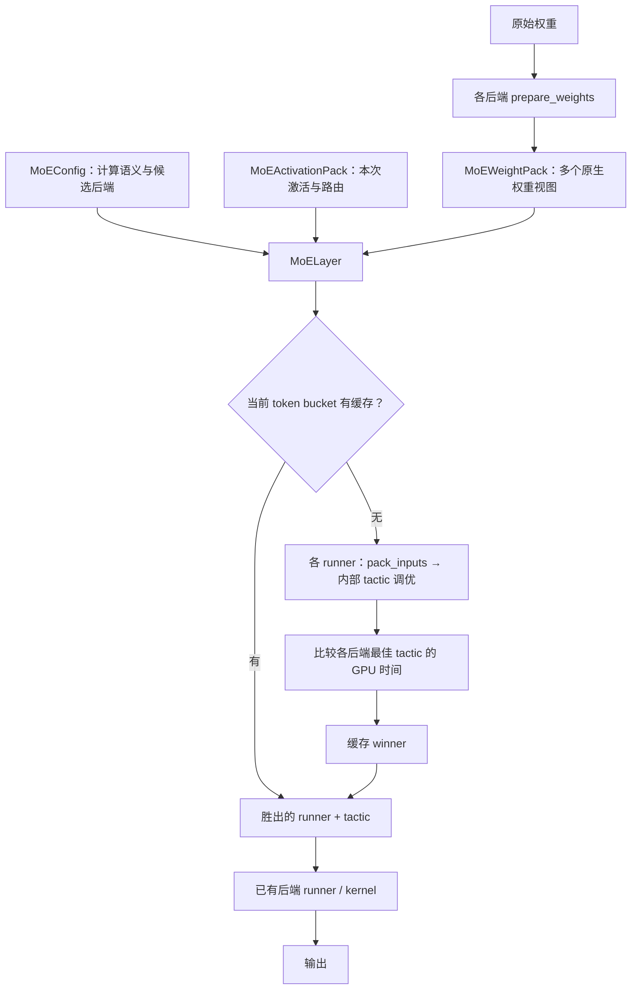

# FlashInfer Unified MoE API：设计与演进

核对日期：2026-09-09

Unified MoE API 将 MoE 的计算语义与后端执行策略分开：调用方提供配置、激活和权重，FlashInfer 负责后端适配、后端内部 tactic 调优，以及跨后端选择。它先用一个范围明确的 NVFP4 MVP 验证这套接口，再逐步扩展路由、量化、后端和执行契约。

## 1. 核对基线与阅读边界

| 项目 | 基线 |
| --- | --- |
| 原始需求 | [Issue #2358：MoE unified interface](https://github.com/flashinfer-ai/flashinfer/issues/2358) |
| 首版实现 | [PR #3093：Unified MoE API: MoELayer with cross-backend NVFP4 autotune](https://github.com/flashinfer-ai/flashinfer/pull/3093)，2026-06-10 合并 |
| 首版合并 commit | [`6ece522337b6`](https://github.com/flashinfer-ai/flashinfer/commit/6ece522337b618c73050fa912b07058b68038a55) |
| 本次主线快照 | [`fb9612816ade`](https://github.com/flashinfer-ai/flashinfer/commit/fb9612816ade4cf93f5a48cd5605da1c7879ec0e)，2026-09-09，量化格式三轴改造 #4952 |
| 核对方式 | 上游源码、设计文档、PR 元数据、提交历史和评审讨论 |
| 性能与测试边界 | 文中 GPU 数字引用上游历史记录；本次没有独立运行 GPU benchmark 或测试 |

#3093 的 PR 描述保留了一些早期 draft 状态和旧测试文件名。其设计文档前半部分也包含长期设想。理解首版实际能力，应以合并代码及文档的 [MVP As-Built Reference](https://github.com/flashinfer-ai/flashinfer/blob/6ece522337b618c73050fa912b07058b68038a55/docs/design_docs/flashinfer_moe_api.md#L638) 为准。本笔记中的“当前”指上述主线快照，不表示某个已发布版本的稳定 API 承诺。

## 2. 为什么需要统一接口

原来的 MoE 入口直接带着后端与量化格式，例如 `trtllm_fp4_block_scale_moe`、`trtllm_fp8_block_scale_moe`、`cutlass_fused_moe`。上层框架需要自己处理：

- 根据硬件、量化与模型配置选择函数；
- 适配长参数列表及不同 scale、routing、weight layout 约定；
- 为不同后端维护预处理、测试和 benchmark；
- 根据 token 数和 expert geometry 选择性能更好的实现。

Issue #2358 将目标明确为可组合接口、统一测试面和跨后端 autotune。首版的两个具体目标是 canonicalize 输入、用后端 prepare 函数处理差异，以及在多个后端之间自动选择。[需求来源](https://github.com/flashinfer-ai/flashinfer/issues/2358)

这里的 autotune 需要区分两个层次：已有后端内部可以有 tactic 调优；Unified MoE 增加的是公共调用面上的跨后端选择。

## 3. #3093 的实际架构

首版范围是 **NVFP4、SwiGLU、预路由输入，以及 CuTeDSL 和 TRTLLM 两个后端**。`MoELayer` 会在构造时拒绝非 NVFP4 或非 SwiGLU 配置。[layer.py:101](https://github.com/flashinfer-ai/flashinfer/blob/6ece522337b618c73050fa912b07058b68038a55/flashinfer/fused_moe/layer.py#L101)

| 对象 | 职责 | 生命周期 |
| --- | --- | --- |
| `MoEConfig` | 组合 routing、quant、expert geometry、activation、backend、execution 配置 | 通常随模型层固定 |
| `MoEActivationPack` | 本次激活、scale、路由输入 | 每次 forward |
| `MoEWeightPack` | 各后端需要的原生权重表示 | 模型加载时准备，长期复用 |
| Runner | 将公共 Pack 转换为后端输入，委托已有实现执行 | 随 layer 复用 |
| `MoELayer` | 筛选候选、调优、缓存并执行胜出的 runner/tactic | 随模型层复用 |

配置使用 frozen dataclass；派生配置使用 `dataclasses.replace()`。Pack 是运行时数据容器，不应与不可变配置混为一谈。[api.py:435](https://github.com/flashinfer-ai/flashinfer/blob/6ece522337b618c73050fa912b07058b68038a55/flashinfer/fused_moe/api.py#L435)



### 3.1 按数据生命周期分组

早期设计曾用 `MoETensors`、`Gemm1Tensors`、`Gemm2Tensors` 按计算阶段组织张量。评审后删除了这组抽象，保留 activation pack 和 weight pack。

原因是不同实现可能采用两个 GEMM 加辅助 kernel，也可能高度融合甚至采用 megakernel。如果公共 API 固定暴露 GEMM1/GEMM2 边界，就会依赖某一种内部执行图；“每次变化的激活”和“长期复用的权重”则能跨实现成立。[作者的设计说明](https://github.com/flashinfer-ai/flashinfer/pull/3093#discussion_r3383237025)

`MoEWeightPack.native_views` 按 `backend_key` 保存多个权重视图。后端的 `prepare_weights()` 负责量化、重排和布局转换，`prepare_for()` 注册结果，`get_view()` 在调用时取用。因此公共语义可以统一，而各后端仍保留自己的物理布局。跨后端调优所需的多份权重表示，是显式的显存成本。[api.py:480](https://github.com/flashinfer-ai/flashinfer/blob/6ece522337b618c73050fa912b07058b68038a55/flashinfer/fused_moe/api.py#L480)

### 3.2 适配层委托已有 runner

首版适配关系为：

| Unified runner | 委托对象 |
| --- | --- |
| `CuteDslNvfp4Runner` | `CuteDslFusedMoENvfp4Runner` |
| `TrtllmFp4RoutedRunner` | `core.MoERunner`，由 `get_trtllm_moe_sm100_module()` 导出 |

`pack_inputs()` 将 Pack 转为后端的原生 tensor list，`get_valid_tactics()` 与 `forward()` 委托已有实现。验证期间曾发现适配层与更新后的 `core.py` 调用约定不一致；委托 canonical runner 将易漂移的底层调用集中到已有实现维护。[runners.py:41](https://github.com/flashinfer-ai/flashinfer/blob/6ece522337b618c73050fa912b07058b68038a55/flashinfer/fused_moe/runners.py#L41)、[runners.py:128](https://github.com/flashinfer-ai/flashinfer/blob/6ece522337b618c73050fa912b07058b68038a55/flashinfer/fused_moe/runners.py#L128)

## 4. 跨后端 autotune 如何执行

### 4.1 两级选择

第一层在每个后端内部寻找最佳 tactic，即该实现的一组 kernel 执行配置；第二层比较各后端胜出 tactic 的 GPU 时间。

拆成两层有一个实现约束：现有 `AutoTuner.choose_one()` 在一次比较中使用同一份 `inputs`，但 CuTeDSL 与 TRTLLM 的原生输入结构不同。因此首版对每个 runner 分别调用下面这段代码：

```python
_, tactic = self.tuner.choose_one(
    custom_op=f"moe_{runner.backend_key}",
    runners=[runner],
    tuning_config=runner.tuning_config,
    inputs=inputs,
)
```

随后比较各后端胜出 tactic 的 `runner.forward()` 时间，使用 CUDA Graph、5 次 dry run、30 次 repeat，按中位数选择。这里的跨后端计时发生在 `pack_inputs()` 之后，不包含模型加载时的权重准备成本。[layer.py:145](https://github.com/flashinfer-ai/flashinfer/blob/6ece522337b618c73050fa912b07058b68038a55/flashinfer/fused_moe/layer.py#L145)

### 4.2 从单一 winner 改为 bucket 缓存

同一层的 decode 和 prefill 可能适合不同后端。首版最终采用以下逻辑：

```python
bucket = map_to_hybrid_bucket(act_pack.num_tokens, ceiling)
winner = self._winners.get(bucket)
if winner is None:
    winner = self._select_winner(act_pack, weight_pack)
    self._winners[bucket] = winner
```

`ExecutionConfig.tune_max_num_tokens` 设置 token ceiling；超过 ceiling 会要求重新构造 layer。`winner_backend` 返回最近一次调用的后端，`reset_winner()` 清空 layer 的 winner 缓存。[layer.py:121](https://github.com/flashinfer-ai/flashinfer/blob/6ece522337b618c73050fa912b07058b68038a55/flashinfer/fused_moe/layer.py#L121)

该缓存依附于固定配置和设备的 layer 实例。按 token bucket 缓存不能理解为跨任意模型、权重 geometry 和配置复用的全局最佳后端表。

### 4.3 为什么必须实测

上游记录的 B200、DeepSeek-V3 geometry、EP=1 测量条件为：hidden size 7168、intermediate size 2048、256 experts、top-k 8、NVFP4 + SwiGLU。以下是 2026-06-01 历史 sweep 的部分结果：

| Tokens | CuTeDSL，ms | TRTLLM，ms | 较快后端 |
| --- | --- | --- | --- |
| 512 | 1.134 | 0.942 | TRTLLM |
| 1024 | 1.199 | 1.306 | CuTeDSL |
| 16384 | 3.742 | 4.613 | CuTeDSL |

早期选择器使用普通调用计时，Python 和 launch 开销曾干扰后端选择。改为 CUDA Graph 计时后，明显分离的性能点能选到较快后端；接近测量噪声的点仍可能在重复测量间翻转。

这些数字说明最佳后端随 geometry 与 token 数变化，不能外推为所有模型或当前 kernel 版本的性能排序。本次没有独立复现。[历史测量和选择器修正](https://github.com/flashinfer-ai/flashinfer/blob/6ece522337b618c73050fa912b07058b68038a55/docs/design_docs/flashinfer_moe_api.md#L738)

## 5. 从 MVP 到多后端语义契约

| 阶段 | 主要变化 | 设计意义 |
| --- | --- | --- |
| 2026-06-10 | [#3093](https://github.com/flashinfer-ai/flashinfer/pull/3093)：NVFP4、SwiGLU、预路由、两个后端 | 验证 Pack、适配、调优和缓存的完整路径 |
| 2026-06-30 | [#3686](https://github.com/flashinfer-ai/flashinfer/pull/3686)：统一计算接入 NCCL-EP/NIXL-EP | 组合 `dispatch → compute → combine`，统一 MoE 承担本地 expert 计算 |
| 2026-07 | [#3892](https://github.com/flashinfer-ai/flashinfer/pull/3892)：`FromLogits`；[#4026](https://github.com/flashinfer-ai/flashinfer/pull/4026)、[#4091](https://github.com/flashinfer-ai/flashinfer/pull/4091)：block/per-tensor FP8；[#3983](https://github.com/flashinfer-ai/flashinfer/pull/3983)：b12x | 扩展路由输入、量化和硬件路径，按能力筛选后端 |
| 2026-08-10、08-12 | [#4328](https://github.com/flashinfer-ai/flashinfer/pull/4328)：CUTLASS BF16/W4A16；[#4376](https://github.com/flashinfer-ai/flashinfer/pull/4376)：runner 生命周期及 compound tactic 调优 | 先验证支持条件，再 build 和 execute；完善分阶段 kernel 的调优 |
| 2026-08-24、08-27 | [#4614](https://github.com/flashinfer-ai/flashinfer/pull/4614)：未 finalize 输出；[#4613](https://github.com/flashinfer-ai/flashinfer/pull/4613)：类型化 activation | 输出及归并方式、激活参数成为明确契约 |
| 2026-09-02 | [#4797](https://github.com/flashinfer-ai/flashinfer/pull/4797)：每次调用绑定 TRTLLM launch state | 避免交错调用串用权重、路由和 tuning config |
| 2026-09-09 | [#4909](https://github.com/flashinfer-ai/flashinfer/pull/4909)：BF16/block-FP8 unpacked 路由；[#4952](https://github.com/flashinfer-ai/flashinfer/pull/4952)：量化格式三轴 | 保留 routing weight 精度，并明确 MMA 数值格式 |

### 5.1 与 Expert Parallel 的组合

首版 #3093 的 wide-EP benchmark 是单 rank、只在本地 experts 内路由的计算代理；它没有完整模拟跨 rank dispatch 和负载不均衡。

#3686 才把统一计算接入 `MoEEpLayer` 的 `dispatch → compute → combine`。该 PR 报告了 BF16 多 GPU 端到端验证，同时把 NVFP4 compute 问题列为当时的后续工作。因此不能用 #3093 的本地计算测量，或 #3686 的 BF16 验证，替代所有精度下的完整 EP 验证。[#3686 的功能与验证边界](https://github.com/flashinfer-ai/flashinfer/pull/3686)

### 5.2 路由输入成为显式模式

| 模式 | 调用方提供 | 执行方式 |
| --- | --- | --- |
| `PackedPrecomputed` | 已算好的 top-k IDs/weights | TRTLLM 适配层通常将两者合成 packed int32 输入 |
| `UnpackedPrecomputed` | 分开的 IDs/weights | 支持此模式的 runner 直接消费分开的 tensor |
| `FromLogits` | logits，必要时附 routing bias | 后端在 kernel 内计算路由 |

当前 `MoELayer` 根据 `supported_routing_modes` 筛选候选，winner cache 扩展为 `(token bucket, routing mode)`，防止为预路由选中的后端接收到不支持的 logits 输入。[layer.py:233](https://github.com/flashinfer-ai/flashinfer/blob/fb9612816ade4cf93f5a48cd5605da1c7879ec0e/flashinfer/fused_moe/layer.py#L233)

#4909 将 TRTLLM BF16 和 block-FP8 接入 unpacked 路径。调用方的 BF16/FP32 weights 保持原有 dtype；FP32 weights 避免了 packed 路径转为 BF16 bits 的精度收窄。每个 runner 的模式支持仍需单独检查。[#4909](https://github.com/flashinfer-ai/flashinfer/pull/4909)

### 5.3 从 activation 枚举到类型化值

#4613 将首版 `ActivationConfig(type=ActivationType.Swiglu)` 演进为 `SwiGLU`、`SiTU`、`GeGLU`、`ReLU2` 等具体不可变类型。`SwiGLU` 携带 alpha、beta、limit，`SiTU` 携带 gate scale、linear scale、clamp limit。

这样函数身份与合法参数 schema 绑定在一起，完整语义进入缓存标识；runner 可以拒绝无法表示的参数，减少参数被静默丢弃的可能。低层 `ActivationType` 继续作为 kernel ABI 枚举存在。[#4613](https://github.com/flashinfer-ai/flashinfer/pull/4613)、[runners.py:629](https://github.com/flashinfer-ai/flashinfer/blob/fb9612816ade4cf93f5a48cd5605da1c7879ec0e/flashinfer/fused_moe/runners.py#L629)

### 5.4 调用状态与 runner 状态分离

早期 TRTLLM `pack_inputs()` 返回普通 tensor list，同时把本次 launch 元数据存在共享的 `runner._static_kwargs`。因此以下交错顺序存在覆盖风险：

```text
pack(A) → pack(B) → forward(A)
```

#4797 引入 `_TrtllmPackedInputs`，将 tensor list、不可变 `_TrtllmLaunchState` 和对应 `TuningConfig` 绑定。执行 A 时可以取回 A 的调用状态。

此修改限定于 TRTLLM；CUTLASS、b12x 等仍有各自的 workspace 或 wrapper 状态，不能据此推导整个 `MoELayer` 已经全面线程安全。PR 提出的更一般 `RunnerCall` / `Invocation` 对象，是后续跨后端抽象方向。[#4797](https://github.com/flashinfer-ai/flashinfer/pull/4797)

## 6. 量化配置为什么先收敛、再拆分

这条演进线反映了功能范围扩大后，配置语义需要变得更精确。

| 阶段 | 配置表达 | 原因 |
| --- | --- | --- |
| 早期设计 | `QuantDtype`、`QuantGranularity`、具体 variant | 试图组合描述格式与量化方式 |
| #3093 MVP | 单一 `QuantVariant` | 用 NVFP4、DeepSeekFp8、FP8PerTensor 等命名预设收窄首版复杂度 |
| #4952 | `weight`、`activation`、`output` 三个 `QuantFormat` 轴 | 将 MMA 格式与含混的位宽或实现名称分离 |

随着后端扩展，`QuantVariant` 混入了不同层次的名称：`NVFP4` 是格式，`W4A16` 是位宽组合，`Humming` 带有实现名称含义。尤其 `W4A16` 在不同后端上可能指 NVFP4 或 MXFP4 权重，选择后端可能间接决定权重编码。

#4952 要求明确格式。下面是表示 MXFP4 权重、BF16 MMA 激活、BF16 输出的当前配置示例：

```python
from flashinfer.fused_moe import QuantConfig, QuantFormat

quant = QuantConfig(
    weight=QuantFormat.MXFP4,
    activation=QuantFormat.BF16,
    output=QuantFormat.BF16,
)
```

这三个轴描述 MMA 权重/激活格式及层输出格式。Python API 接收的 tensor dtype 可能不同：例如 CUTLASS NVFP4 接收 BF16 激活，在 kernel 内量化，其 MMA 格式对仍然是 `(NVFP4, NVFP4)`。

旧 `variant=` 保留为带弃用告警的预设；有歧义的 `QuantVariant.W4A16` 不能直接作为该参数，必须明确权重格式。配置对象只检查格式轴的结构类型，实际合法组合由 runner 能力决定。[api.py:199](https://github.com/flashinfer-ai/flashinfer/blob/fb9612816ade4cf93f5a48cd5605da1c7879ec0e/flashinfer/fused_moe/api.py#L199)

当前改造仍有过渡边界：部分内部 build/prepare 分发继续依赖旧 `QuantVariant`，没有旧 variant 映射的格式对会被拒绝；各 runner 当前也仍以 BF16 输出为支持范围。枚举中出现 FP16 等名字不代表已经存在完整 kernel 路径。[#4952](https://github.com/flashinfer-ai/flashinfer/pull/4952)、[runners.py:507](https://github.com/flashinfer-ai/flashinfer/blob/fb9612816ade4cf93f5a48cd5605da1c7879ec0e/flashinfer/fused_moe/runners.py#L507)

## 7. 当前能力边界

### 7.1 关闭 autotune context 仍可能触发跨后端计时

当前 `_select_winner()` 在 layer winner cache 未命中时仍然执行 `bench_gpu_time()`。后端内部 `choose_one()` 的 tuning mode、缓存或 fallback 行为，与 layer 的跨后端计时是两个层次。

因此，“不进入 `autotune(True)` 就完全没有 profiling”是不能依赖的假设。应在部署前覆盖需要的 token bucket 和 routing mode；不要把首次选择放到要求纯 replay 的路径中。[layer.py:275](https://github.com/flashinfer-ai/flashinfer/blob/fb9612816ade4cf93f5a48cd5605da1c7879ec0e/flashinfer/fused_moe/layer.py#L275)

### 7.2 公共入口仍保留后端布局约束

当前 `MoEActivationPack` 中的 activation 编码依赖后端。例如 TRTLLM/CuTeDSL NVFP4 使用 packed 激活，而 CUTLASS NVFP4 接收原始 BF16；per-tensor FP8 的 scale 约定也有差异。同一个 pack 未必能直接用于所有候选后端，配置中的候选集合、准备好的 weight views 和 activation payload 必须匹配。[api.py:1873](https://github.com/flashinfer-ai/flashinfer/blob/fb9612816ade4cf93f5a48cd5605da1c7879ec0e/flashinfer/fused_moe/api.py#L1873)

### 7.3 首版设计目标不能等同于首版交付

早期文档中的 eager `moe_layer()`、`find_backends()`、pipe operator、组件级 benchmark、repro 工具和结构化 TVM-FFI 边界，不属于 #3093 全部已经交付的能力。首版保留旧 flat API，并增加 Pack + MoELayer 路径；判断某个后续功能是否可用，要继续检查对应版本源码。[MVP 实际交付说明](https://github.com/flashinfer-ai/flashinfer/blob/6ece522337b618c73050fa912b07058b68038a55/docs/design_docs/flashinfer_moe_api.md#L638)

### 7.4 统一测试覆盖与性能证据分开解读

首版测试覆盖每个候选后端与同一 BF16 reference 的比较、layer 输出、候选访问、CUDA Graph capture/replay 和 EP offset。共享参考可以发现“两个后端以相同方式算错”的问题，单纯比较两个后端是否一致不足以替代它。

合并前作者在 GB300 报告 `test_unified_moe.py` 107 项通过；同一日志中的 fuzzer 是 86 项跳过，不能记为 86 项 GPU 验证通过。[合并前测试记录](https://github.com/flashinfer-ai/flashinfer/pull/3093#issuecomment-4671573048)

## 8. 源码阅读顺序

1. 首版 [api.py:435](https://github.com/flashinfer-ai/flashinfer/blob/6ece522337b618c73050fa912b07058b68038a55/flashinfer/fused_moe/api.py#L435)：理解 config 与两种 Pack 的职责。
2. 首版 [layer.py:121](https://github.com/flashinfer-ai/flashinfer/blob/6ece522337b618c73050fa912b07058b68038a55/flashinfer/fused_moe/layer.py#L121)：跟踪 bucket、winner、pack 和 forward。
3. 首版 [runners.py:81](https://github.com/flashinfer-ai/flashinfer/blob/6ece522337b618c73050fa912b07058b68038a55/flashinfer/fused_moe/runners.py#L81)：比较后端原生输入约定。
4. 当前 [runners.py:447](https://github.com/flashinfer-ai/flashinfer/blob/fb9612816ade4cf93f5a48cd5605da1c7879ec0e/flashinfer/fused_moe/runners.py#L447)：理解能力声明、调用状态与 `check_support → build → execute`。
5. 当前 [api.py:199](https://github.com/flashinfer-ai/flashinfer/blob/fb9612816ade4cf93f5a48cd5605da1c7879ec0e/flashinfer/fused_moe/api.py#L199)、[layer.py:233](https://github.com/flashinfer-ai/flashinfer/blob/fb9612816ade4cf93f5a48cd5605da1c7879ec0e/flashinfer/fused_moe/layer.py#L233)：对照量化格式三轴及 routing-mode winner cache。
