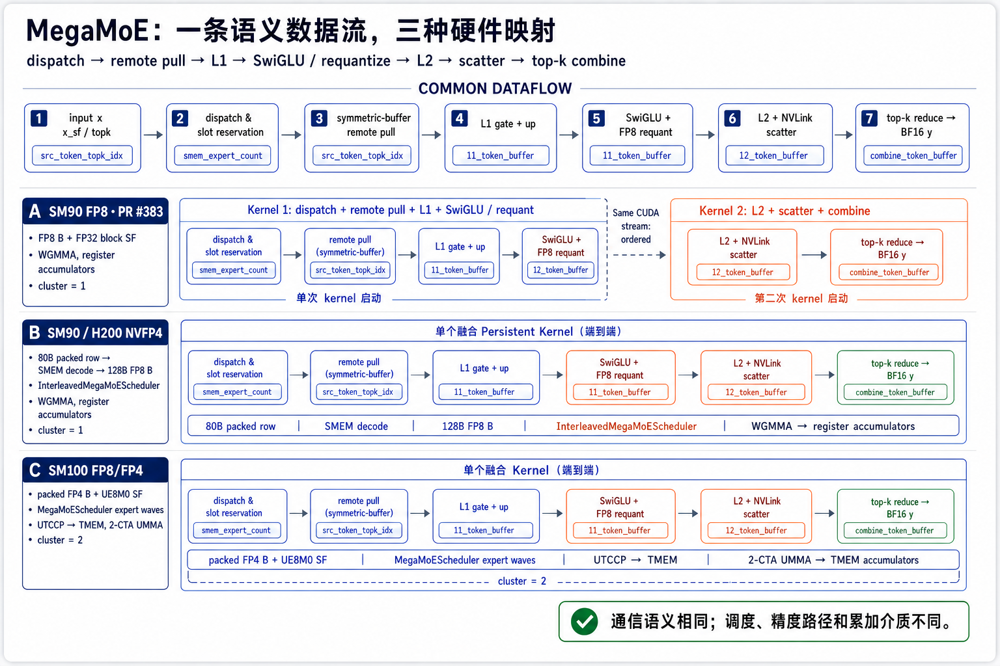
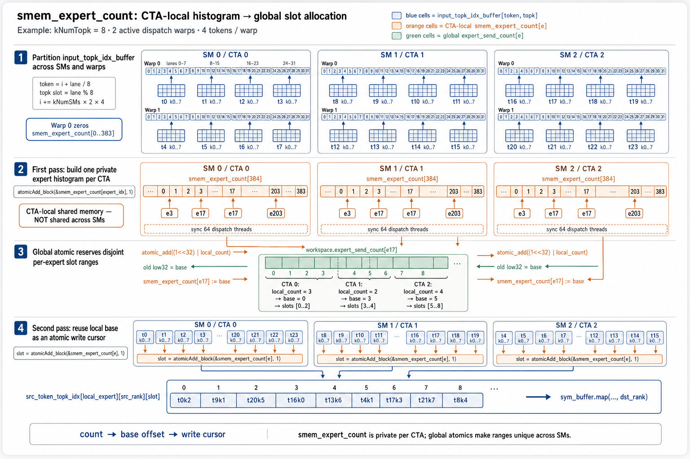
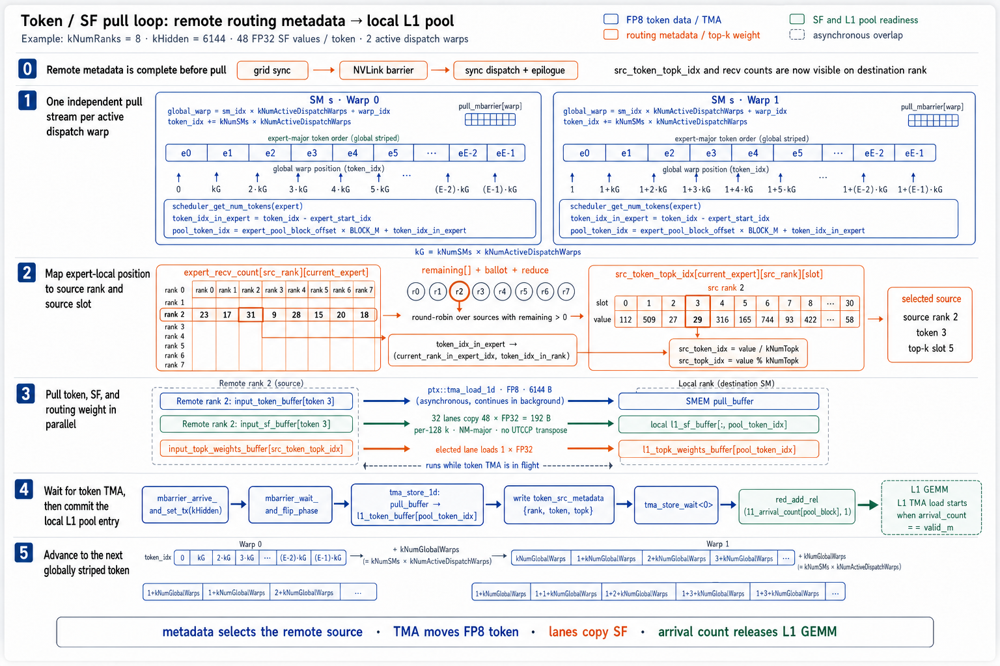
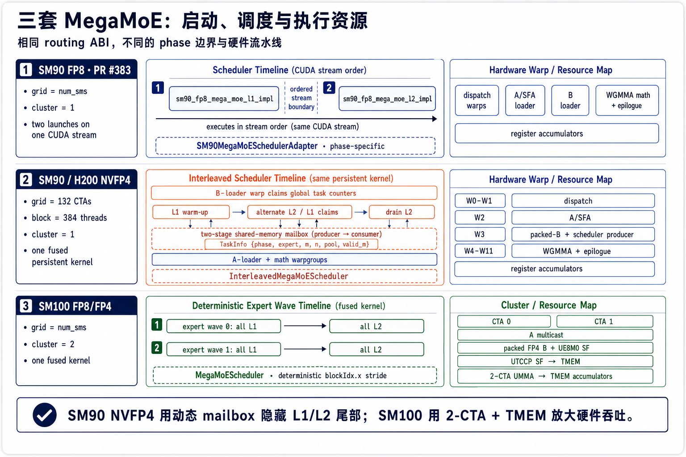
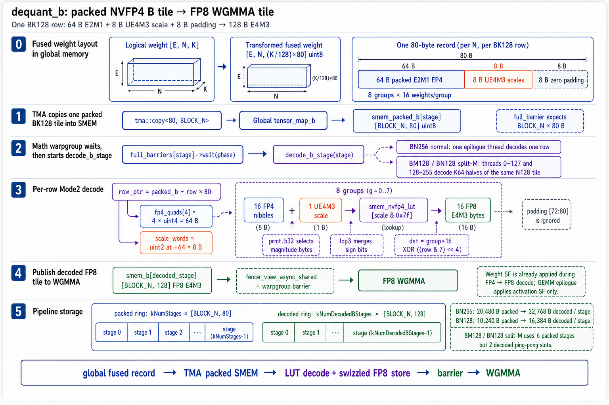
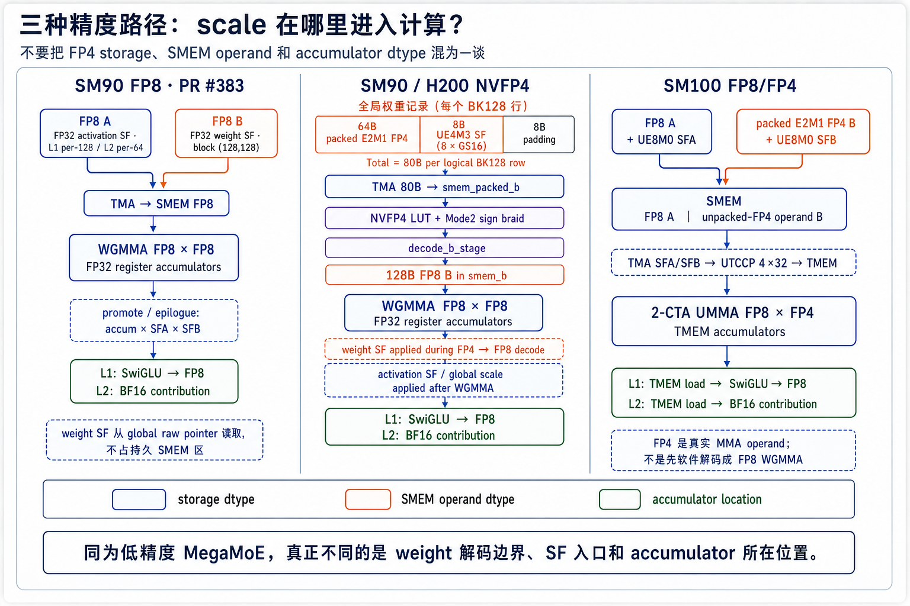

# 读懂 DeepGEMM MegaMoE：同一条 MoE 数据流，为什么在 SM90 FP8、SM90 NVFP4 和 SM100 上长成三种实现

如果只盯着 GEMM，会很容易误解 MegaMoE。

它真正想解决的不是“把两层 expert MLP 做快一点”，而是把一整段 MoE 数据流放进少量 persistent CTA 中：读取路由结果、跨 rank 收 token、按 expert 建池、执行 L1、做 SwiGLU 和重量化、执行 L2、把贡献散回来源 rank，最后完成 top-k reduce。

DeepGEMM 里至少有三套值得放在一起看的实现：

- PR #383 的 **SM90 FP8 MegaMoE**；
- 面向固定 H200 配置的 **SM90 NVFP4 fused MegaMoE**；
- 使用 Blackwell TMEM/UMMA 的 **SM100 FP8/FP4 MegaMoE**。

它们共享 routing 与 symmetric-buffer 语义，却没有共享同一种 kernel 边界、调度器或低精度计算路径。本文从源码的数据所有权和执行时序出发，解释这三套实现为什么不同。

> 阅读边界：本文是源码静态解读，不是 H200/B200 上的 Nsight trace 或性能结论。SM90 FP8 对应 PR #383 代码快照；SM90 NVFP4 与 SM100 对应 `megamoe_nvfp4_dev_m` 代码快照。实现仍在快速演进，文中的“更好”只表示设计目标，不代表已经完成同条件 benchmark 验证。



## 先给结论：相同的是通信语义，不同的是硬件映射

三套实现都能抽象成同一条逻辑流水线：

```text
x / x_sf / topk_idx / topk_weights
    ↓
dispatch：为每个 expert 统计并预留 slot
    ↓
remote pull：把来源 rank 的 token/SF 拉入本地 expert pool
    ↓
L1：gate/up GEMM
    ↓
SwiGLU + amax + FP8 requantize
    ↓
L2：得到 BF16 contribution，并散回来源 rank/top-k slot
    ↓
top-k combine → BF16 y
```

真正分叉的是以下三件事。

| 实现 | kernel 边界 | 调度方式 | MMA 与累加介质 |
|---|---|---|---|
| SM90 FP8 · PR #383 | L1、L2 两次顺序 launch | `SM90MegaMoESchedulerAdapter`，每次只选择一个 phase | FP8 WGMMA，FP32 register accumulator |
| SM90/H200 NVFP4 | 单个 fused persistent kernel | `InterleavedMegaMoEScheduler`，全局抢任务并通过两级 SMEM mailbox 广播 | FP4 先在 SMEM 解码成 FP8，再做 WGMMA；FP32 register accumulator |
| SM100 FP8/FP4 | 单个 fused kernel，2-CTA cluster | `MegaMoEScheduler`，按 expert wave 静态遍历 L1→L2 | 2-CTA UMMA，accumulator 与 SF 进入 TMEM |

这张表也是阅读代码时最重要的导航：看到同名的 `Workspace`、dispatch 或 combine，不要因此推断三套 GEMM pipeline 也相同。

## 1. 共同底座：symmetric buffer 是通信池，不是权重仓库

每个 rank 都注册一块大小和布局相同的 symmetric buffer。相同虚拟 offset 在不同 rank 上表示同一种数据，而：

```cpp
sym_buffer.map(local_ptr, dst_rank_idx)
```

把本 rank 的逻辑地址映射到目标 rank 对应位置。它使 kernel 可以直接写远端的 `src_token_topk_idx`、receive count 或 combine slot，而不需要先构造一份 NCCL send buffer。

这块 buffer 主要由五类区域组成：

| 区域 | 典型内容 | 生命周期 |
|---|---|---|
| `Workspace` | grid/NVLink barrier、expert send/recv count、arrival count/mask、source metadata | 一次 MegaMoE 调用 |
| registered input | `x`、`x_sf`、`topk_idx`、`topk_weights` | 调用输入 |
| L1 pool | `l1_token_buffer`、`l1_sf_buffer`、routing weight | dispatch → L1 |
| L2 pool | SwiGLU 后的 FP8 token 与 SF | L1 → L2 |
| combine pool | 每个原始 token、每个 top-k slot 的 BF16 contribution | L2 scatter → combine |

expert weights 不在这里。L1/L2 权重是模型张量，保留在普通 global memory，通过各自的 TMA descriptor 或 raw pointer 进入 GEMM pipeline。symmetric buffer 解决的是跨 rank 数据可寻址性；把数百个 expert 的权重复制进通信池既没有必要，也会把容量需求放大到不可接受。

池容量也不是按当前 batch 的真实 token 数临时生成，而是预留一个上界：

```cpp
num_max_pool_tokens = align(
    num_ranks * num_max_tokens_per_rank * min(num_topk, num_experts_per_rank)
      + num_experts_per_rank * (192 - 1),
    384);
```

前半部分是最坏 routing 容量，后半部分给每个 local expert 的 `BLOCK_M≤192` 尾块留 padding。TMA descriptor 因而使用 `config.num_max_pool_tokens` 描述合法 backing storage，而 `valid_m`、arrival count 和 scheduler 决定本次真正消费多少行。

## 2. Dispatch：`smem_expert_count` 为什么要经历三种身份

dispatch warp 把 `input_topk_idx_buffer` 里的每个 token-topk 项分配给目标 expert。一个 CTA 内的 `smem_expert_count[e]` 会依次表示：

```text
本 CTA 发往 expert e 的数量
    ↓ global atomic_add 返回旧值
本 CTA 在 expert e 全局队列中的 base slot
    ↓ block-scope atomicAdd
本 CTA 写 src_token_topk_idx 时的游标
```



关键代码是两次遍历中间的全局 reservation：

```cpp
const uint64_t send_value =
    (1ull << 32) | static_cast<uint64_t>(smem_expert_count[i]);

smem_expert_count[i] = static_cast<uint32_t>(
    ptx::atomic_add(
        workspace.get_expert_send_count_ptr(i),
        send_value));
```

低 32 位累计 token 数，高 32 位累计参与的 SM 数。`atomic_add` 返回的旧低 32 位天然就是当前 CTA 的起始 slot。随后：

```cpp
const auto dst_rank_idx = expert_idx / kNumExpertsPerRank;
const auto dst_slot_idx =
    atomicAdd_block(smem_expert_count + expert_idx, 1);

const auto dst_ptr = workspace.get_src_token_topk_idx_ptr(
    expert_idx % kNumExpertsPerRank,
    sym_buffer.rank_idx,
    dst_slot_idx);

*sym_buffer.map(dst_ptr, dst_rank_idx) = token_topk_idx;
```

如果 `dst_rank_idx == 4`，最终效果就是写 rank 4 symmetric buffer 中的：

```text
src_token_topk_idx[
    local_expert_idx
][source_rank_idx][dst_slot_idx]
```

这里第二维存的是“这个 token 来自哪个 rank”，不是目标 rank。目标 rank 已经由 `sym_buffer.map(..., 4)` 选择。

## 3. Token/SF pull：通信不是先全部完成，再开始 GEMM

目标 rank 收到各来源 rank 写来的 source index 与 receive count 后，dispatch warp 按 expert-major 顺序拉取 token。每个 active dispatch warp 拥有独立的 `pull_buffer` 和 `mbarrier`：



对当前 `token_idx_in_expert`，代码先根据各 source rank 的剩余 token 数，选择 `current_rank_in_expert_idx` 和 `token_idx_in_rank`，再反查：

```text
src_token_topk_idx
    → src_token_idx
    → src_topk_idx
```

随后 token 使用一维 TMA 拉入 shared-memory pull buffer；TMA 飞行期间，warp 的 lane 同时复制 activation SF 和 top-k weight。等 token mbarrier 完成后，再把 token TMA store 到本地 `l1_token_buffer`，写 source metadata，并递增：

```cpp
workspace.get_l1_arrival_count_ptr(pool_block_idx)
```

因此 L1 loader 等待的不是“整个 dispatch 完成”，而是当前 pool block 的 arrival count 达到 `valid_m`。通信与计算可以沿不同 expert/block 形成流水。

SM100 的 dispatch 还会对 SF token index 做 UTCCP 需要的 `4×32` 变换；SM90 FP8/NVFP4 则把 FP32 activation SF 直接写成 math warpgroup 消费的 MN-major 形式。这是相同 routing 语义下，第一个明确的架构分支。

## 4. SM90 FP8：为什么保留 L1/L2 两次 launch

PR #383 的 runtime 明确生成两个 kernel symbol：

```cpp
launch_with_phase(
    MegaMoEPhaseKind::Linear1,
    "sm90_fp8_mega_moe_l1_impl");

launch_with_phase(
    MegaMoEPhaseKind::Linear2,
    "sm90_fp8_mega_moe_l2_impl");
```

它们提交到同一个 CUDA stream，所以执行顺序是确定的：L1 kernel 完成后，L2 kernel 才能开始。这里不存在两个 kernel 跨 launch 并行；并行发生在每个 kernel 内部的 dispatch、TMA、WGMMA 与 epilogue 角色之间。

L1 phase 做 dispatch/pull、gate/up WGMMA、SwiGLU、amax、FP8 requantize，并生成 L2 pool。L2 phase 读取这个 pool，计算 BF16 contribution、NVLink scatter、top-k combine，dispatch warp 在该 phase 主要负责与 epilogue 协同清理 workspace。

Hopper 没有 SM100 的 TMEM/UTCCP 计算路径，这套实现让 FP8 A/B 通过 TMA 进入 SMEM，用 WGMMA 产生 FP32 register accumulator。量化尺度也采用直接形式：

- L1 activation SF：每 128 channel 一个 FP32；
- L2 activation SF：每 64 channel 一个 FP32；
- weight SF：每个 `(128,128)` block 一个 FP32；
- weight SF 直接从 global raw pointer 读取，不为它建立 TMA descriptor，也不长期占据 `smem_buffer`。

因此它的优点是契约清楚、shape 更通用；代价是 L1/L2 之间有 kernel 边界，无法在同一个 CTA 内用动态调度填掉 L1/L2 尾部气泡。

## 5. SM90 NVFP4：把 kernel 边界换成动态 mailbox

H200 NVFP4 版本选择了相反方向：固定核心 shape 与 launch 配置，换取单 kernel 内更激进的融合。

当前源码约束为：

```text
132 SMs / 132 CTAs
8 ranks
48 local experts per rank
top-k = 8
hidden = 6144
intermediate_hidden = 2048
block = 384 threads
cluster = 1
```

warp 角色也被固定下来：W0-W1 dispatch，W2 加载 A/SFA，W3 加载 packed B 并生产 scheduler task，W4-W11 是两个 WGMMA math/epilogue warpgroups。



`InterleavedMegaMoEScheduler` 的关键不是“遍历顺序换了一下”，而是只有 B-loader warp 去竞争全局 task counter。它把获得的 32-byte `TaskInfo` 写入两级 shared-memory mailbox：

```cpp
struct alignas(16) TaskInfo {
    BlockPhase block_phase;
    uint32_t local_expert_idx;
    uint32_t m_block_idx;
    uint32_t n_block_idx;
    uint32_t pool_block_idx;
    uint32_t valid_m;
    uint32_t shape_n;
    uint32_t shape_k;
};
```

A-loader 和 math warpgroup 消费同一份 payload，不需要各自对全局原子计数器抢任务。调度先做最小 L1 warm-up，再交替 claim L2/L1，最后 drain 剩余 L2。`l1_task_count` 只保证相应 L1 N-task 已被发出；真实数据是否可读仍由 `l1_arrival_count` 与 `l2_arrival_mask` 决定。

换句话说，scheduler 管“谁做哪个 tile”，arrival primitive 管“数据现在能不能做”。这两个条件缺一不可。

### 5.1 NVFP4 的 80B 不是 SMEM 自创格式

每个逻辑 BK128 weight row 在 global memory 中已经被 host transform 融合为：

```text
64B packed E2M1 FP4
+ 8B UE4M3 scale（8 个 GS16 scale）
+ 8B padding
= 80B
```

所以 global fused tensor 的 storage-K 是 `(logical_K / 128) * 80`。TMA 每次把 `[BLOCK_N,80]` 搬到 `smem_packed_b`，math warpgroup 再解码到 `[BLOCK_N,128]` 的 FP8 `smem_b`。



这条路径有一个容易说错的边界：

```text
global storage：packed E2M1 FP4 + UE4M3 SF
        ↓ decode_b_stage，weight SF 在这里生效
SMEM operand：FP8 E4M3
        ↓
WGMMA：FP8 × FP8 → FP32 register accumulators
```

所以它不是 Hopper 上的“原生 FP4 WGMMA”。NVFP4 降低了 global-memory 权重流量，但 WGMMA 看见的仍然是 FP8 B。

## 6. SM100：FP4 真正进入 UMMA，scale 和 accumulator 进入 TMEM

SM100 的 `fp8_fp4_mega_moe` 仍是单个 fused kernel，但它没有复用 SM90 NVFP4 的 interleaved mailbox。runtime 启动：

```cpp
LaunchArgs(
    num_sms,
    config.num_dispatch_threads
        + config.num_non_epilogue_threads
        + config.num_epilogue_threads,
    config.smem_size,
    2);  // cluster size
```

`MegaMoEScheduler` 从 `blockIdx.x` 开始，以 `kNumSMs` 为步长做确定性遍历。每个 expert wave 先分配全部 L1 block，再回到该 wave 的起点分配全部 L2 block，然后进入下一 wave。`num_experts_per_wave` 由期望 token/expert 与可并行 block 数选择，目标是让 wave 中有足够任务覆盖所有 SM。

2-CTA cluster 不是可有可无的 launch 参数。相邻 CTA 共享同一个 M block、处理相邻 N block；kernel 在初始化时做 cluster sync，并使用 `cute::TMEM::Allocator2Sm` 分配 2-SM tensor memory。A tile 可以在 cluster 内 multicast。

更重要的是精度边界发生了变化：

```text
A：FP8 E4M3 + UE8M0 SFA
B：packed E2M1 FP4 + UE8M0 SFB
SF：TMA → SMEM → UTCCP 4×32 → TMEM
MMA：2-CTA UMMA FP8 × FP4
accumulator：TMEM
```

epilogue 再从 TMEM load accumulator，完成 L1 SwiGLU/FP8 输出或 L2 BF16 contribution。也就是说，SM100 的 FP4 是 UMMA 的真实 B operand；它不需要像 SM90 NVFP4 那样先由软件在 SMEM 解码成 FP8 WGMMA tile。



## 7. L1 epilogue：三套实现重新汇合的地方

不论 accumulator 来自 SM90 register 还是 SM100 TMEM，L1 epilogue 最终都要完成相同数学语义：

```text
gate = GEMM(x, W_gate)
up   = GEMM(x, W_up)
z    = SiLU(gate) * up
z    = z * topk_weight
```

随后按输出分组计算 `amax`，得到 FP8 scale 与 inverse scale，将 `z` 量化后写进 L2 token pool，同时写 L2 activation SF。

`SMEM_CD_L1_SIZE` 使用 FP8 不是因为 accumulator 已经是 FP8，而是因为它保存的是 epilogue 之后、准备 TMA store 到 L2 pool 的量化输出：

```cpp
kNumEpilogueWarpgroups
    * WG_BLOCK_M
    * WG_L1_OUT_BLOCK_N
    * sizeof(cutlass::float_e4m3_t)
```

FP32 accumulator 位于寄存器或 TMEM；`smem_cd_l1` 是输出 staging buffer。两者不能混为一谈。

## 8. L2 scatter 与 combine：为什么还需要一次 NVLink barrier

L2 的每一行都带着 dispatch 时保存的 source metadata：

```text
source rank
source token index
source top-k slot
```

epilogue 依此把 BF16 contribution 写到来源 rank 的：

```text
combine_token_buffer[topk_slot][token_idx]
```

本地 CTA sync 或 grid sync 只能证明“本 rank 的线程走到了这里”，不能证明其他 rank 的远端写也全部对系统可见。因此 combine 前仍需要 NVLink/system-scope barrier。所有 rank 宣告 scatter 完成后，每个 combine warp 才双缓冲拉取有效 top-k slot，在 FP32 中累加、转成 BF16，再 TMA store 到 `y`。

这里也能看到 MegaMoE 的核心思路：它并不是调用一个独立 all-to-all、等待、再调用两个 grouped GEMM、再等待，而是把通信进度、tile readiness 和计算角色放在同一个持久执行框架中。

## 9. 如何选择阅读入口

如果要继续沿源码追下去，可以按以下顺序：

### SM90 FP8 · PR #383

```text
deep_gemm/mega/__init__.py
  transform_weights_for_mega_moe_sm90
      ↓
csrc/apis/sm90_mega.hpp
      ↓
csrc/jit_kernels/impls/sm90_fp8_mega_moe.hpp
      ↓
deep_gemm/include/deep_gemm/impls/sm90_fp8_mega_moe.cuh
      ↓
deep_gemm/include/deep_gemm/scheduler/sm90_mega_moe.cuh
```

### SM90/H200 NVFP4

```text
deep_gemm/mega/__init__.py
  transform_nvfp4_weights_for_mega_moe_sm90
      ↓
csrc/apis/mega.hpp
      ↓
csrc/jit_kernels/impls/sm90_nvfp4_mega_moe_h200_fused.hpp
      ↓
deep_gemm/include/deep_gemm/impls/
  sm90_nvfp4_mega_moe_h200_fused.cuh
  sm90_nvfp4_mega_moe_h200_fused.inl
      ↓
deep_gemm/include/deep_gemm/scheduler/mega_moe.cuh
  InterleavedMegaMoEScheduler
```

### SM100 FP8/FP4

```text
deep_gemm/mega/__init__.py
  fp8_fp4_mega_moe
      ↓
csrc/apis/mega.hpp
      ↓
csrc/jit_kernels/impls/sm100_fp8_fp4_mega_moe.hpp
      ↓
deep_gemm/include/deep_gemm/impls/sm100_fp8_fp4_mega_moe.cuh
      ↓
deep_gemm/include/deep_gemm/scheduler/mega_moe.cuh
  MegaMoEScheduler
```

## 10. 最后的判断

把三套实现放在一起后，MegaMoE 的设计主线会清楚很多：

1. **routing ABI 尽量稳定。** `Workspace`、source index、expert pool、arrival state、combine slot 构成共同骨架。
2. **SM90 FP8 优先通用、清晰。** 两个 phase kernel 用 stream 顺序建立 L1→L2 边界，FP8 WGMMA 与 FP32 block scale 直接对应数学定义。
3. **SM90 NVFP4 优先固定 workload 的端到端融合。** host 预排 80B record，device 在 SMEM 解码，动态 mailbox 让同一个 persistent kernel 交错推进 L1/L2。
4. **SM100 把同一语义重新映射到新硬件。** 2-CTA cluster、UTCCP、UMMA、TMEM 改变了 scale 入口、MMA operand 和 accumulator 所在位置，因此不适合用 SM90 的寄存器/WGMMA 心智模型解释。

所以，“MegaMoE 是哪个 kernel”不是最好的问题。更准确的问题是：**在给定架构上，routing、数据就绪、权重表示、MMA 和 combine 分别由谁推进，它们之间用什么状态连接。**

顺着这五个问题读代码，三套看似庞杂的实现会收敛成同一条数据流的三种硬件化答案。
