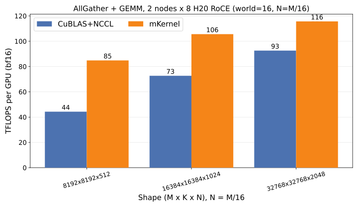
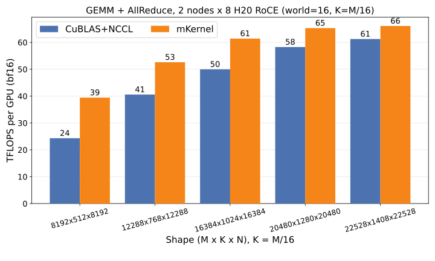
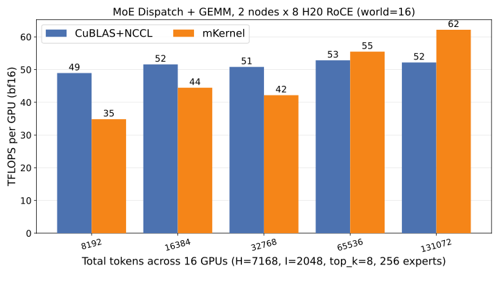
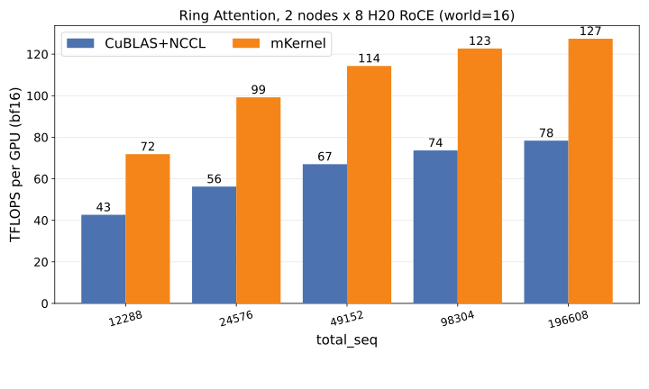
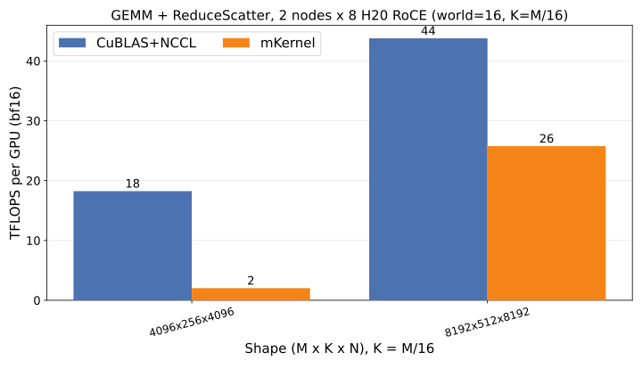

# mKernel H20 Two-Node Release-Shape Comparison

Date: 2026-06-01 Asia/Shanghai

Source: [uccl-project/mKernel](https://github.com/uccl-project/mKernel)

## Privacy Note

This note is intentionally sanitized for a public/personal notebook. It omits exact Kubernetes pod names, node hostnames, cluster IPs, SSH aliases, key paths, internal filesystem paths, and raw command logs. The retained information is limited to public repository context, generalized hardware/runtime facts, benchmark methodology, numerical results, and non-sensitive debugging conclusions.

## Test Scope

- Hardware: private two-node NVIDIA H20 environment, `2 x 8` GPUs, `world=16`.
- Network path: H20 RoCE using the NCCL IB path.
- Baseline: CuBLAS+NCCL with `NCCL_CUMEM_HOST_ENABLE=0`.
- mKernel data: H20 release-shape run from the peermem-compatible implementation branch.
- Measurement settings: `WARMUP=3`, `ITERS=10`.
- Plot style: same per-kernel comparison chart format as the upstream `plots/plot_tflops_efa.py` output. The `_efa` filename suffix is preserved for upstream plot-script compatibility; the actual test environment here is H20 RoCE.

## Comparison Results

| Kernel | Plot |
| --- | --- |
| AllGather + GEMM |  |
| GEMM + AllReduce |  |
| MoE Dispatch + GEMM |  |
| Ring Attention |  |
| GEMM + ReduceScatter |  |

## Result Summary

The structured result table is stored at [results/h20_two_node_release_cumemhost0_20260601.csv](results/h20_two_node_release_cumemhost0_20260601.csv).

Key observations from this run:

- `NCCL_CUMEM_HOST_ENABLE=0` removed the prior NCCL shared-memory attach failure in this H20 container environment.
- `ring_attention` completed the largest release shape in this rerun.
- mKernel was faster than the CuBLAS+NCCL baseline for `ag_gemm`, `gemm_ar`, and `ring_attention` across the measured shapes.
- `dispatch_gemm` crossed over at larger token counts.
- `gemm_rs` still only has two completed mKernel release-shape points in this dataset, and both are slower than the NCCL baseline.
