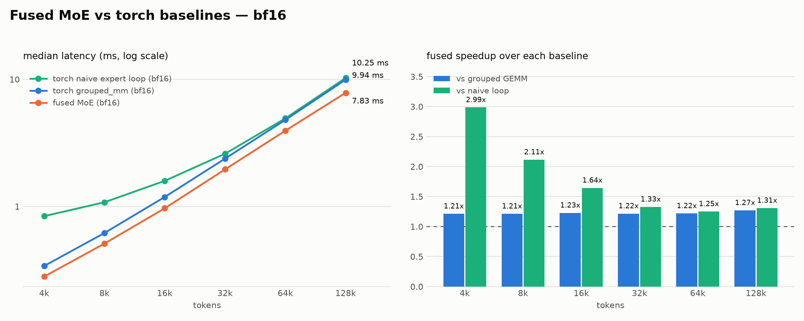
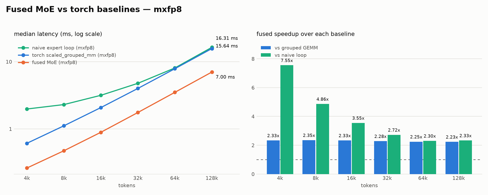
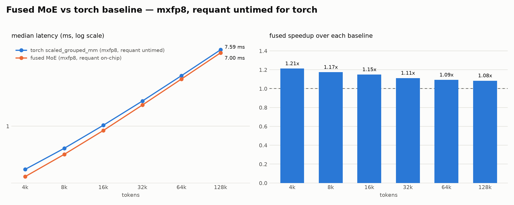

# Prime Flash MoE benchmark on Modal B200

## Configuration

| Item | Value |
| --- | --- |
| Time | 2026-08-26 08:11:42 UTC / 16:11:42 CST |
| GPU | 1× NVIDIA B200, 183359 MiB |
| GPU clocks reported by `nvidia-smi` | SM 1965 MHz, memory 3996 MHz |
| Driver | 580.95.05 |
| Compute capability | 10.0 |
| Container | `nvcr.io/nvidia/pytorch:26.07-py3` |
| PyTorch | `2.13.0a0+9186a08b2c.nv26.07` |
| CUDA build / NVCC | 13.3 / 13.3.73 |
| Python | 3.12.3 |
| Source commit | `1820183d63eed79fd166fbf4b81cae2b27b326c2` |
| Workload | E=32, top-k=4, K=2048, N=2048, H=1024 |
| Timing | median of 50 CUDA Graph replays |

Command:

```bash
python benchmark/benchmark.py --outdir /tmp/prime-flash-moe-20260826-081142
```

This is the script's default run. It does not include `--check`, so the
correctness columns in the CSV are `nan`.

## Summary

- bf16 fused speedup over `torch.nn.functional.grouped_mm`: **1.21×–1.27×**.
- bf16 fused speedup over the naive expert loop: **1.31×–2.99×**.
- mxfp8 fused speedup over `scaled_grouped_mm`, including baseline requantization: **2.23×–2.35×**.
- mxfp8 fused speedup over the naive expert loop: **2.30×–7.55×**.
- Against the deliberately favorable no-requant torch baseline, fused mxfp8 remains **1.08×–1.21×** faster.

## bf16

| Tokens | Naive loop | Grouped GEMM | Fused MoE | Fused vs grouped | Fused vs naive |
| ---: | ---: | ---: | ---: | ---: | ---: |
| 4k | 0.838 ms | 0.340 ms | 0.281 ms | 1.21× | 2.99× |
| 8k | 1.079 ms | 0.618 ms | 0.510 ms | 1.21× | 2.11× |
| 16k | 1.590 ms | 1.187 ms | 0.968 ms | 1.23× | 1.64× |
| 32k | 2.597 ms | 2.378 ms | 1.957 ms | 1.22× | 1.33× |
| 64k | 4.928 ms | 4.797 ms | 3.941 ms | 1.22× | 1.25× |
| 128k | 10.246 ms | 9.940 ms | 7.835 ms | 1.27× | 1.31× |



## mxfp8

| Tokens | Naive loop | Scaled grouped GEMM | Fused MoE | Fused vs grouped | Fused vs naive | Grouped without requant | Fused vs no-requant |
| ---: | ---: | ---: | ---: | ---: | ---: | ---: | ---: |
| 4k | 1.975 ms | 0.610 ms | 0.262 ms | 2.33× | 7.55× | 0.317 ms | 1.21× |
| 8k | 2.298 ms | 1.111 ms | 0.473 ms | 2.35× | 4.86× | 0.555 ms | 1.17× |
| 16k | 3.158 ms | 2.076 ms | 0.890 ms | 2.33× | 3.55× | 1.023 ms | 1.15× |
| 32k | 4.761 ms | 3.996 ms | 1.752 ms | 2.28× | 2.72× | 1.948 ms | 1.11× |
| 64k | 8.053 ms | 7.852 ms | 3.495 ms | 2.25× | 2.30× | 3.818 ms | 1.09× |
| 128k | 16.313 ms | 15.644 ms | 7.002 ms | 2.23× | 2.33× | 7.590 ms | 1.08× |





## Artifacts

- [`moe_bench.csv`](moe_bench.csv): complete numeric results.
- [`benchmark.log`](benchmark.log): benchmark stdout.
- [`environment.json`](environment.json): source, software, CUDA, and GPU metadata.
- [`manifest.json`](manifest.json): download manifest.
