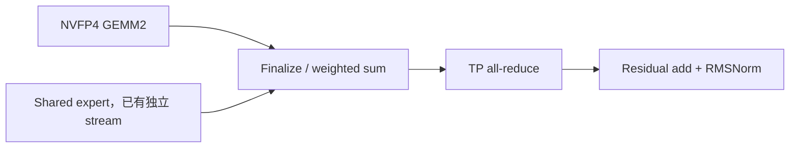

# GLM-5.3 / B300：decode 跨引擎优化详情

日期：2026-09-14。承接 [128k prefill 调查](../glm53_b300_prefill128k_20260914/cross_engine_optimization_research.md)，对照 SGLang、vLLM、TensorRT-LLM、TokenSpeed 的源码、PR 与官方博客。

**当前 1K、BS=1 场景，应先优化 target verify 的小 M 投影、MoE 后处理及层间同步；保持 DCP=1。长上下文则增加 DSA selection、KV 容量和 DCP crossover 的专项验证。** 已有 TGV、Top-K V2、FP8 KV、IndexShare、CUDA graph 的收益不能重复记作新增空间。

本文复用已有 decode trace 分析和 benchmark，重新核对源码与上游状态；没有运行新的 GPU 实验。候选 kernel 的上游速度不等于本模型 TPOT 的收益。

## 1. 本次 decode 与 prefill 的关键区别

| 项目 | 本次 decode 基线 |
|---|---|
| 模型 / 硬件 | GLM-5.3 NVFP4，78 层，hidden=6144；8 × B300，SM103、148 SM/GPU |
| 工作负载 | ISL=1024、OSL=1024、BS=1、temperature=0；生成中上下文继续增长 |
| 并行 | TP8 / EP8 / DP1 / DCP1；保留 prefill CP8，启用 `enable_cp_decode_attn_tp` |
| Kernel | DSA TRTLLM、FP8 KV、FlashInfer TRTLLM NVFP4 MoE；多处 dense/shared 路径仍为 BF16 |
| 推测解码 | EAGLE，steps=5、topk=1、draft_tokens=6；target verify 的 token 维度 M=6 |
| Graph | draft、verify、draft_extend 均已 capture；每轮三次 replay |
| 运行版本 | `0.5.19.dev1010+g9e9c71411`；与本地研究 checkout 不同 |

Prefill 中 attention TP=1、大 M=4096 的结论不能直接搬过来。此处 decode 出现每层 attention 输出 all-reduce，小 GEMM 的 tile/launch 成本、expert rank 到达差异与 EAGLE 摊销变得重要。

| 既有测量 | 无 profiler TPOT | 平均 accept length | 带 profiler TPOT |
|---|---:|---:|---:|
| DCP1 | **1.9216 ms/token** | 5.47 | 9.6435 ms/token |
| DCP8 + ag_rs + symmetric memory | **3.2291 ms/token** | 5.28 | 13.2827 ms/token |

两组无 profiler 数据均只有一次请求测量；DCP8 约慢 68%，需重复验证其幅度。带 profiler 的结果包含严重采样/导出干扰，不能作为正常 TPOT 基线。8 rank trace 各包含 11 个完整轮次，以下稳定段用第 2–11 轮，排除首轮但保留剩余抖动。

| 阶段 | rank 0 GPU graph 墙钟均值 | 三段 graph 占比 | Kernel 数/轮 |
|---|---:|---:|---:|
| Draft | 0.8748 ms | 8.3% | 166 |
| Target verify | **9.2993 ms** | **88.6%** | 2009 |
| Draft extend | 0.3224 ms | 3.1% | 44 |

这是每轮推测解码的耗时，不能写成每 token 耗时。近似成本模型为 `TPOT ≈ 每轮总耗时 / 每轮实际输出 token 数`；draft、verify、accept/commit、graph 间隙都计入分子。不能用 5.47 直接替代每一个被捕获轮次的实际接受长度。

可复核的既有 benchmark、每阶段和完整 kernel 名称已归档到 [decode_baseline_evidence.json:1](decode_baseline_evidence.json)。表中 kernel 累计可能重叠，也可能包含同步等待。

## 2. 瓶颈预算与 kernel / module 对照

Verify 的 kernel sum 为 **12.2041 ms**，大于 graph 墙钟 9.2993 ms；下表占比以 kernel sum 为分母。它用来选优化对象，不能把各项直接相加当关键路径。

| 分类 | ms/verify | 占 kernel sum | 主要 module / 调用入口 | trace 中对应 kernel |
|---|---:|---:|---|---|
| Dense GEMM | 4.0372 | 33.1% | `self_attn.fused_qkv_a_proj_with_mqa`、`q_b_proj`、`o_proj`、MLA BMM、Indexer 投影、`mlp.shared_experts`、前三层 dense MLP、LM head | `nvjet_sm103_tst_*`、`cublasLt::splitKreduce_kernel`、`sglang::fused_a_gemm_kernel`、`TgvGemmCuteExtKernel`、router 的 `tiny_n_gemm_kernel` |
| 通信及等待 | 2.0846 | 17.1% | embedding、attention 输出、MoE 输出的 TP collective，LM head logits gather；通常不是独立 `nn.Module` | `sglang::all_reduce_1shot_push_kernel`、`_all_gather_kernel_inner` |
| MoE GEMM | 1.8291 | 15.0% | `mlp.experts` → FlashInfer TRTLLM runner | `bmm_E2m1_E2m1E2m1_*_swiGlu_dynB_sm100f`、`bmm_Bfloat16_E2m1E2m1_*_dynB_sm100f` |
| Norm / activation | 1.1832 | 9.7% | input/post-attention norm、Q/KV norm、shared SwiGLU | `FusedAddRMSNormKernel`、`RMSNormKernel`、`sglang::act_and_mul_kernel` |
| MoE routing / quant / finalize | 1.1785 | 9.7% | routing、NVFP4 input quant、`finalize_flashinfer_trtllm_deferred_output` 等 | `routingIndicesDynBlockKernel`、`NVFP4QuantizeLinearKernel`、`sglang::moeFinalizeKernel` |
| Attention 核心 | 1.1111 | 9.1% | `self_attn.attn_mqa` / DSA backend → TRTLLM sparse MLA | `fmhaSm100fKernel_QkvE4m3OBfloat16HQk576HV512HVPerCta256PagedKvDenseStaticTokenSparseP1MultiCtasKvVarSeqQ8Kv128StaticSwapsAbForGen` |
| DSA Indexer 专用 | 0.3970 | 3.3% | `self_attn.indexer`；不含归入 Dense GEMM 的通用投影 | `deep_gemm::sm100_paged_mqa_logits`、`sglang::topk_small_batch_kernel`、`fused_k_indexer_norm_rope_store`、`fused_q_indexer_rope_hadamard_quant` |
| RoPE / KV 写入 | 0.3740 | 3.1% | Q/K RoPE + FP8 转换，KV pool 写入 | `flashinfer::RopeQuantizeKernel`、`set_mla_kv_buffer_kernel` |
| 其他 | 0.0094 | 0.1% | 剩余 copy / fill 等 | 见证据 JSON |

这里用 kernel 名称族匹配分类；同一 `nvjet_*` 会服务多个 module，不能靠名字唯一反推出 module。Dense 中 attention 侧投影约 2.4485 ms、shared GEMM 约 1.2962 ms；shared/routed 已有双 stream 重叠，不能假设这些累计时间都能等量回收到墙钟。

## 3. 可落地优先级

| 顺序 | 方案 | 当前覆盖 / 增量 | 适用条件与实施程度 |
|---|---|---|---|
| P0 | 无 profiler 重复基线 + 多 rank 到达分析 | 所有结果的测量基础；入口 custom AR 有明显等待 | 直接做；先不要改并行拓扑 |
| P1 | M=6 投影/shared kernel 与 epilogue 调优 | Dense 4.04 ms；已有 TGV 和 fused-A，应找遗漏形状及 split-K 尾部 | 微基准 → 真实 graph A/B；不是只开 BF16 开关 |
| P1 | NVFP4 MoE runner 对照、shared/routed 分支资源调优 | Expert GEMM 1.83 ms、后处理 1.18 ms；rank 执行不齐 | 配置候选需核对 precision recipe，保存真实路由分布 |
| P1 开发 | 为 GLM NVFP4/TP8 扩展 finalize + shared add + AR | 每轮 75 次 finalize、75 次 MoE AR；当前不命中融合入口 | 需要扩展模型、量化 ABI、TP8 和 hidden6144，并验证数值 |
| P2 | 一轮 graph、GPU accept/commit、稳定 metadata | 现有 graph 间隙和入口到达差；三段 graph 已存在 | 需要执行器改造；收益不能与入口等待重复相加 |
| P2 | 短上下文 `KV≤K` 的 k-only graph | 21 次 logits、selection 和部分 Q/gate 投影可避免 | 当前 CUDA verify 不支持直接启用，保留 K-cache 更新 |
| P2 | EAGLE 步数/verify width、greedy draft argmax reduction | accept=5.47 已较高；draft 链约 1.20 ms | 直接扫参 + 可选移植；优化 TPOT 而非只看接受率 |
| 长上下文 P1 | SGL V2 vs TRTLLM GVR vs TokenSpeed cluster selection | 1K Top-K 仅 0.0579 ms/verify；长序列再评估 | 需要兼容物理 page 索引、MTP 多行与状态生命周期 |
| 长上下文 P2 | DCP2/4/8，ag_rs vs a2a；减少排序/搬运 | 当前 DCP8 明显回归 | 长度/并发矩阵实测 crossover，不能认定 DCP 越大越快 |
| 容量 / 并发 | DEP + NVLink A2A、HiSparse、P/D、microbatch overlap | 面向显存压力与多请求吞吐 | 拓扑/调度级工作，不是本次 BS1 的现成收益 |

四个引擎的借鉴重点可概括为：

| 引擎 | Decode 值得借鉴的部分 | 本例如何采用 |
|---|---|---|
| SGLang | TGV/fused-A、DSA V2、IndexShare、deferred finalize、custom AR | 核查已有命中；扩展 GLM NVFP4 的融合边界与遗漏形状 |
| TensorRT-LLM | GVR exact Top-K、NVLink dispatch/combine、collective/norm fusion | 长上下文 selection 移植；通信方案需匹配 TP/DEP 和量化 ABI |
| TokenSpeed | 一轮 graph、设备端 sampling/draft、cluster Top-K、融合通信 | 优先借鉴执行顺序与状态管理；普通 MLA 与 GLM sparse MLA 分开评价 |
| vLLM | greedy local argmax、MTP index buffer、uniform graph padding、DCP/HiSparse | 精简 draft 通信；高并发与长上下文时评估图覆盖、容量及服务拓扑 |

## 4. 小 M Dense：已有快路径之上的优化

### 4.1 TGV 已经出现，fused-A 还有独立 dispatch

Trace 每轮 verify 已有 21 次 `TgvGemmCuteExtKernel`，78 次 `fused_a_gemm_kernel`，后者累计 **0.6269 ms**。当前 `--bf16-gemm-backend auto` 在 SM100/103、非 deterministic 配置下会解析为 `cutedsl`，再按形状回退：[unquant.py:155](https://github.com/sgl-project/sglang/blob/8ba15052e93be305b1696b5ce89629789cada6cb/python/sglang/srt/layers/quantization/unquant.py#L155)。

TGV selector 对 `(M,N,K)` 判断，M=6 并不保证命中：例如它会拒绝许多 N<1024、K<2048 的形状；N>4096、K较小也有额外限制。完整条件见 [cutedsl_bf16_gemm.py:1357](https://github.com/sgl-project/sglang/blob/8ba15052e93be305b1696b5ce89629789cada6cb/python/sglang/kernels/ops/gemm/cutedsl_bf16_gemm.py#L1357)。

`fused_qkv_a_proj_with_mqa` 的 `[6,6144] × [6144,2624]` 还走模型专用 `prepare_qkv_latent → linear_with_fused_a_gemm`。B300 的 `backend="auto"` 选 JIT C++，其选择独立于通用 BF16 TGV 开关：[deepseek_v2.py:2401](https://github.com/sgl-project/sglang/blob/8ba15052e93be305b1696b5ce89629789cada6cb/python/sglang/srt/models/deepseek_v2.py#L2401)、[fused_a_gemm.py:24](https://github.com/sgl-project/sglang/blob/8ba15052e93be305b1696b5ce89629789cada6cb/python/sglang/kernels/ops/gemm/fused_a_gemm.py#L24)。因此仅改变 `--bf16-gemm-backend`，不一定改变这个热点。

建议收集每个 QKV-A、Q-B、O、shared gate-up/down 的实际 `(M,N,K,stride,dtype,stream)`，在 M=1/4/5/6/8/16 下分别比较：专用 fused-A、TGV、cuBLASLt 以及与相邻 norm/SwiGLU 融合的候选。保持真实 TP 分片，不能复用 prefill TP1 的大 N/K 形状。

Verify 还有 **103 次 split-K reduction，共 0.3017 ms**。它提示应比较「GEMM + split-K reduction」整体与单 kernel tactic；不是证明 split-K 一定更差。权重轮转应避免一直命中 L2，预热后用 CUDA graph 测量，并把共享分支并行时的 SM/带宽竞争计入。

SGLang TGV 的真实 PR 是 [#30117](https://github.com/sgl-project/sglang/pull/30117)。[GLM5.2 博客](https://www.lmsys.org/blog/2026-07-13-glm52-optimization) 的 GEMM 链接指向 #30177，但该 PR 实际是 `return_hidden_states="last"` 功能；本报告以 PR 内容核对，避免沿用链接错误。博客的 TP4、M=1–32 数字也不能当本次 TP8/M=6 的新增收益。

### 4.2 降精度是另一条实验线

NVFP4 experts 不代表 BF16 QKV/O/shared 可直接改成 FP4。可以先测试针对性 FP8 投影或 W4A16 expert runner，但需独立检查模型量化配置、校准尺度、SwiGLU/clamp、输出质量和 accept length；后者若下降，kernel 提速可能被更多 verify 轮次抵消。先完成同精度 tactic/融合 A/B，更容易解释原因。

## 5. MoE finalize + shared add + collective：最值得开发的融合点

当前链条为：



每轮 standalone finalize **0.3681 ms**；MoE 输出 AR **1.1097 ms**。这 1.48 ms 是所覆盖 kernel 的累计预算，包含 peer 等待，不是可全部消除的工作量。

SGLang [#38879](https://github.com/sgl-project/sglang/pull/38879) 已在 9 月 10 日合入 DSV4.1 的 Blackwell 优化，含 deferred finalize/shared add/custom push AR。它的端到端结果包含多项优化，不能归因为单个 fusion，更不能迁移其百分比到 GLM。

本地代码存在 **四道重要边界**：

| 边界 | 当前要求 | GLM-5.3 基线 |
|---|---|---|
| 模型与并行 | `is_deepseek_v4 and is_blackwell and tp_size == 4` | GLM、TP8，不命中 |
| Hidden width | 模型入口 `hidden_states.shape[-1] == 5120` | 6144，不命中 |
| 量化方法 | `Mxfp4FlashinferTrtllmMoEMethod`、default precision、routing scaling 已折入权重 | ModelOpt NVFP4，需要单独 adapter |
| 通信 / 布局 | CustomAllReduceV2 push plane、buffer 容量、有效 cluster geometry、shared 分片与 metadata ready | 必须逐项验证，不可只放宽 shape 断言 |

源码：[deepseek_v2.py:636](https://github.com/sgl-project/sglang/blob/8ba15052e93be305b1696b5ce89629789cada6cb/python/sglang/srt/models/deepseek_v2.py#L636)、[deepseek_v2.py:1065](https://github.com/sgl-project/sglang/blob/8ba15052e93be305b1696b5ce89629789cada6cb/python/sglang/srt/models/deepseek_v2.py#L1065)、[mxfp4_flashinfer_trtllm_moe.py:569](https://github.com/sgl-project/sglang/blob/8ba15052e93be305b1696b5ce89629789cada6cb/python/sglang/srt/layers/quantization/mxfp4_flashinfer_trtllm_moe.py#L569)。底层通用实现：[all_reduce_fusion.py:193](https://github.com/sgl-project/sglang/blob/8ba15052e93be305b1696b5ce89629789cada6cb/python/sglang/kernels/ops/communication/all_reduce_fusion.py#L193)。

实施顺序：

1. 核对 ModelOpt deferred GEMM2 的 permuted-row layout、`expanded_idx_to_permuted_idx`、expert weights、`-1` 非本地 expert，以及 routed scaling 的施加位置。
2. 先融合 finalize + shared add + AR，保持原来的 BF16 舍入边界；验证 TP8、hidden6144、M=1/6/不同 batch 和 phase-counter 多次 replay。
3. 共享 expert 若为 TP1 复制输出，应在 AR 后加，避免累加 8 次；不能默认它和 TP-sharded shared 的位置相同。
4. 再考虑 residual/RMSNorm。现有 fused kernel 的可选 norm 不能直接代替完整的 `residual += x; norm(residual)` 接口，必须保留残差输出与下游约定。

TokenSpeed/TRTLLM 的 AR+residual+norm 是另一条可复用路线：[trtllm.py:868](https://github.com/lightseekorg/tokenspeed/blob/5354e72ada4644a4ef6ff1adedcd106a85acb8a5/tokenspeed-kernel/python/tokenspeed_kernel/ops/communication/trtllm.py#L868)。FlashInfer 也有 [fusion 反而较慢的实测 issue #3671](https://github.com/flashinfer-ai/flashinfer/issues/3671)，说明 launch 减少必须覆盖额外访存、同步和 occupancy 代价。

## 6. 通信、EP 不均衡与 MoE runner

### 6.1 这里主要是小消息 custom AR

本次每个 verify 有 154 次 custom AR：embedding 1 次、attention 78 次、MoE 75 次。`[6,6144]` BF16 一次逻辑张量只有 **72 KiB**，和 prefill 中 384 MiB RS 的优化目标不同。

Rank 0 的入口 AR 平均 0.4161 ms。MoE 后 AR 的跨 rank 开始跨度均值 17.85 μs，结束跨度仅 1.14 μs；最晚 rank 进入到最后退出约 4.74 μs。同层两次 expert GEMM 在最快/最慢 rank 的均值分别为 16.35/34.67 μs。

因此先查 expert 执行、shared 分支资源竞争和 host 到达差。更快的 collective 不能自动消除慢 rank；`NCCL_NVLS_ENABLE` 也不会直接替换已经运行的 custom push AR。若更换通信后端，要计入 residual/norm 融合和真实 72 KiB 消息，不套用 prefill NVLS 结论。

### 6.2 可以做的 runner 对照

当前 `flashinfer_trtllm` 已把 GEMM1 与 SwiGLU 合在一起，已有 deferred/shared finalize 的迹象；`SGLANG_ENABLE_MOE_DEFERRED_FINALIZE` 在当前 checkout 默认也是 true。重新设为 1 不能算新增优化。

可以独立比较 `--moe-runner-backend flashinfer_cutedsl`：本地支持 ModelOpt NVFP4、`moe_a2a_backend=none`，但 EP 只允许 1 或 TP size。见 [moe_hook.py:58](https://github.com/sgl-project/sglang/blob/8ba15052e93be305b1696b5ce89629789cada6cb/python/sglang/srt/arg_groups/moe_hook.py#L58)。先保持 TP8/EP8 和 W4A4 recipe，检查各层 alpha/scale、输出误差、acceptance；W4A16 另做一组，不与 runner 切换混为一个变量。

测量应保存每层每 rank 的 active experts、routed token 数、padding、两次 GEMM 时间和 collective 到达时间。BS1/M6 下，EPLB 只有在跨请求/多轮存在可预测热点时才可能有用，不能根据一次 rank 时长差就断言需要搬权重。EP4 也不是所有 runner 的合法配置；先核对支持范围再设计拓扑对照。

### 6.3 DEP/A2A、FP8 combine、MegaMoE 的边界

vLLM 的 [GLM5.2 B300 P/D 博客](https://vllm.ai/blog/2026-07-23-glm-5.2-nvfp4-b300-pd) 在 DEP8 场景报告 NVLink two-sided A2A 收益；TRTLLM [#11844](https://github.com/NVIDIA/TensorRT-LLM/pull/11844) 提供 FP8 combine。本例是 DP1 + TP/EP AR，不能直接减去它们报告的通信时间。

SGLang FlashInfer A2A 要求 `enable_dp_attention` 且 `dp_size == tp_size`：[moe_hook.py:263](https://github.com/sgl-project/sglang/blob/8ba15052e93be305b1696b5ce89629789cada6cb/python/sglang/srt/arg_groups/moe_hook.py#L263)。DEP8 可作为多请求 decode 的另一种部署拓扑，BS1 时却可能只用一个 attention replica，同时有大量 idle rank；必须比较延迟、显存、每卡吞吐，不能只改 `moe-a2a-backend`。

MegaMoE [#38563](https://github.com/sgl-project/sglang/pull/38563) 仍 OPEN，提供 NVFP4 recipe 接入，但其 Qwen3.5 结果比 unfused baseline 慢。若探索它，至少区分小 decode session 与大 token capacity，不能每轮为很少 token 支付大 session 成本。更高并发再研究 microbatch overlap，BS1 先优化已有 routed/shared 双 stream。

## 7. Graph 和 host：从三次 replay 到一轮设备执行

### 7.1 先承认已完成的 capture

SGLang [#29413](https://github.com/sgl-project/sglang/pull/29413) 的 draft-extend capture 已有对应 trace 证据。Verify 中 kernel 时间并集占 graph span 的 99.53%，这只说明很少没有 kernel 覆盖，**不是** SM 利用率 99.53%；spin wait 同样计入。

第 2–10 轮，draft 起点间隔均值 11.3709 ms，其中三段 graph span 合计 10.5276 ms，graph 间隙 0.6634 ms，尾部到下轮 0.1799 ms。约 0.8433 ms 的边界预算值得检查，但可能含 profiler、CPU 调度或必要工作；不能全算可省 launch 时间。

### 7.2 TokenSpeed 的可借鉴实现

TokenSpeed 的 `_forward_step` 把 target、sampling、drafter 和下一轮 input 写入放在同一 callable，`ForwardStepRunner` capture/replay 该 callable。关键步骤的真实源码如下（摘取连续片段）：

```python
        if self.drafter is not None:
            next_round_input_ids = self.drafter.run(
                base_ctx=ctx,
                logits_output=logits_output,
                output_tokens=output_tokens,
                accept_lengths=accept_lengths,
            )
```

入口及完整顺序：[model_executor.py:874](https://github.com/lightseekorg/tokenspeed/blob/5354e72ada4644a4ef6ff1adedcd106a85acb8a5/python/tokenspeed/runtime/execution/model_executor.py#L874)；capture：[forward_step.py:480](https://github.com/lightseekorg/tokenspeed/blob/5354e72ada4644a4ef6ff1adedcd106a85acb8a5/python/tokenspeed/runtime/execution/forward_step.py#L480)。它是「当前 target verify → accept/sample → 准备下一轮 draft」的一种排布；不能把现有 SGLang 三张图只用 Python 包一下就称为合图。

移植需要把 accept length、下一轮 input、KV valid length、draft index carry、buffer 地址和通信顺序都纳入设备端状态约定。优先消除不必要 D2H/H2D 和重复 metadata，再设计统一 capture。TokenSpeed 仍有图外 runtime state 更新；「一张图」不意味着完全没有 CPU 开销。[官方设计博客](https://lightseek.org/blog/lightseek-tokenspeed.html)

多请求和 P/D 另检查 graph miss：vLLM [#45237](https://github.com/vllm-project/vllm/pull/45237) 用 speculative padding 保持新到请求与已有请求的 uniform shape；[#45953](https://github.com/vllm-project/vllm/pull/45953) 支持动态 speculative length 与 full graph。它们解决的是混合 batch/graph 兼容问题；本次固定 BS1、三个 graph 都命中的 trace 没有同等问题证据。

## 8. EAGLE / MTP：优化每个接受 token 的成本

先保留 steps=5、draft_tokens=6 作为基线。扫 steps=3/4/5 及对应 verify width=4/5/6；可再试更深，但不预设有效。每组记录：每轮时间、实际输出 token 数、accept length 分布、每个 draft 位置的接受率、TPOT 和 p95/p99 ITL。

若从原来的 `(T,L)` 改为 `(T',L')`，只有 `T'/L' < T/L` 才划算。当前 accept length 5.47 已接近该宽度可输出的上限，减少 draft 可能破坏 verify 的摊销；单独让 draft 更快也覆盖不了 88.6% 的 verify。

### IndexShare / KVShare

已有 trace 中 Indexer logits/Top-K 只有 21 次而非每层 78 次，与模型的 index sharing 路径一致；Q/K Indexer 融合 kernel 也已出现。本地 `IndexTopKShareState` 支持 MTP iteration carry 和 draft-extend seed：[index_topk_share.py:14](https://github.com/sgl-project/sglang/blob/8ba15052e93be305b1696b5ce89629789cada6cb/python/sglang/srt/layers/attention/index_topk_share.py#L14)；skip 层不可临时重算未加载的 indexer 权重：[forward_mla.py:127](https://github.com/sgl-project/sglang/blob/8ba15052e93be305b1696b5ce89629789cada6cb/python/sglang/srt/models/deepseek_common/attention_forward_methods/forward_mla.py#L127)。

vLLM [#44420](https://github.com/vllm-project/vllm/pull/44420)、[#47238](https://github.com/vllm-project/vllm/pull/47238) 值得检查的是跨 draft step 复用和多请求 row compaction 的正确性。TokenSpeed 也有按配置跳过 indexer 的路径：[glm5.py:107](https://github.com/lightseekorg/tokenspeed/blob/5354e72ada4644a4ef6ff1adedcd106a85acb8a5/python/tokenspeed/runtime/models/glm5.py#L107)。这些都是模型声明的共享机制；不要任意增加跨层/跨步的复用范围。

### Greedy draft 的 local argmax reduction

vLLM [#46448](https://github.com/vllm-project/vllm/pull/46448) 在 greedy draft 中调用 `get_top_tokens()`，交换各 TP 分片的候选值和 ID，避免 AllGather 全词表 logits；当前代码见 [speculator.py:271](https://github.com/vllm-project/vllm/blob/553fcb82d5602c75fb6ab41b6dc3c46f480c1785/vllm/v1/worker/gpu/spec_decode/speculator.py#L271)。

本例 temperature=0、EAGLE topk=1，值得检查 draft LM head 是否还有全词表 gather。但先确认它是否需要归一化后的 draft probability、grammar/logits processor、logprob 输出或特殊 tie-break。不能将 greedy argmax 的简化直接用于 probabilistic rejection sampling。本次 target verify 的 logits gather 只有约 0.0079 ms/轮，本身不是主要热点；应单独统计 draft 链的成本。

## 9. DSA：短上下文与长上下文要用不同策略

### 9.1 KV≤2048：优先考虑完全省掉无用分数计算

当每个 query 的有效 causal KV 长度都不超过 K=2048，selection 的集合就是所有有效 token。可以保留 producer 层的 K 投影、norm/RoPE、cache store，直接产生有效物理 slot 与 padding，跳过只服务 selection 的 Q/gate、logits 和排序。

当前源码已有 `_should_skip_logits_computation` 的解释及 ROCm dual-graph 设计，但 CUDA decode 明确不启用；target verify 也不等于普通 `is_decode_or_idle()`。此外当前 k-only 调用还受 `not self.dsa_enable_prefill_cp` 约束。本配置不能只设置环境变量：[dsa_indexer.py:398](https://github.com/sgl-project/sglang/blob/8ba15052e93be305b1696b5ce89629789cada6cb/python/sglang/srt/layers/attention/dsa/dsa_indexer.py#L398)、[dsa_indexer.py:1617](https://github.com/sgl-project/sglang/blob/8ba15052e93be305b1696b5ce89629789cada6cb/python/sglang/srt/layers/attention/dsa/dsa_indexer.py#L1617)。

建议实现 CUDA 的短/长序列 graph variant，覆盖 EAGLE verify 的每个 query causal length。整个 batch 含 padding、draft overshoot、KV≈2048 边界或任一请求超过 K 时，路由到正确 variant；不按启动时短 prompt 永久冻结分支。即使索引集合等价，改变顺序也可能影响浮点累加，仍需对照输出和接受率。

当前 21 次 MQA logits 约 **0.1202 ms**，21 次 Top-K 约 **0.0579 ms**；单独让 Top-K 减半只减少约 0.0289 ms kernel 工作量，约 verify span 的 0.31%，且未扣重叠。因此短序列的策略是研究消除整条无用链，不能沿用长序列 Top-K 宣传幅度。

### 9.2 长序列：比较 SGL V2、TRTLLM GVR、TokenSpeed cluster

SGL V2 已融合 selection + page transform，支持 runtime K≤2048。当前 decode-shaped PAGED dispatcher 同时覆盖匹配 row shape 的 verify/draft-extend：[dsa_topk_backend.py:109](https://github.com/sgl-project/sglang/blob/8ba15052e93be305b1696b5ce89629789cada6cb/python/sglang/srt/layers/attention/dsa/dsa_topk_backend.py#L109)。其 plan/compact page-table 思路见 [#26788](https://github.com/sgl-project/sglang/pull/26788)、[#30274](https://github.com/sgl-project/sglang/pull/30274)；后者初版对 spec 有限制，判断当前能力须看现有代码，不能只读旧 PR 摘要。

TokenSpeed [#634](https://github.com/lightseekorg/tokenspeed/pull/634) 集成 TRTLLM CuTeDSL multi-CTA cluster selection；这是另一种 kernel 候选，不是另一个完全独立算法来源。其 decode MQA 将 verify query 展成逐 token row，要求对应的 seq_lens 和 plan：[__init__.py:332](https://github.com/lightseekorg/tokenspeed/blob/5354e72ada4644a4ef6ff1adedcd106a85acb8a5/tokenspeed-kernel/python/tokenspeed_kernel/ops/attention/deep_gemm/__init__.py#L332)。

TRTLLM [#18446](https://github.com/NVIDIA/TensorRT-LLM/pull/18446) 于 9 月 8 日合入，当前上游配置区分：

| 配置 | 选择路径 |
|---|---|
| `enable_heuristic_topk=false` | insertion/radix |
| 上项 true，`use_self_sampling_topk=true` | GVR V2，使用当前行采样，无 previous-step prior |
| 上项 true，`use_self_sampling_topk=false` | GVR V1，使用 previous-step hint |
| temporal V1 + `use_gvr_emission=true` | 仅满足 FP4 paged-MQA 等条件时用 emission block-skip |

旧的 `TRTLLM_GVR_SELF_SAMPLING` 环境变量已退休；这些字段属于 TRTLLM sparse-attention config，不是 SGLang CLI。GVR 论文描述的是验证/细化后的 exact selection，**不是**未经验证地复用上一轮 Top-K。论文在 DSV3.2/100K/TEP8 报告最高 7.52% TPOT 改善，仅作上游参考。[论文](https://arxiv.org/abs/2604.22312)

SGLang 移植需覆盖：逻辑索引→物理 page slot、IndexShare 的 producer/consumer、MTP 多 query 的 causal mask、接受/拒绝后的 prior 更新、请求换槽和重新排序、非连续 page、短行、tie、padding。先测无 prior 的 V2 和 cluster 方案更易隔离状态问题，再试 temporal V1。保持 K=2048、真实 logits 和含转换的总链时间；不能拿 K512 微基准替代。

### 9.3 Sparse MLA 本体

本例已经是 FP8 sparse FMHA，共 1.1111 ms/verify。可比较实际 `q_len=6`、本地 head 数、有效 Top-K 长度下的 tile、split-K 和 reduction；padding 到 K=2048 时可研究有效长度提前退出，但需 backend 支持。

TokenSpeed 普通 MLA decode 的 query/head folding 很适合解释小 head 数时的利用率问题，但其 GLM DSA adapter 同样调用 TRTLLM sparse MLA：[__init__.py:312](https://github.com/lightseekorg/tokenspeed/blob/5354e72ada4644a4ef6ff1adedcd106a85acb8a5/tokenspeed-kernel/python/tokenspeed_kernel/ops/attention/flashinfer/__init__.py#L312)。普通 MLA 的加速数字不能证明能直接替换有逐 query 稀疏索引的本路径。

## 10. DCP、HiSparse 与服务拓扑

### DCP：有直接 A/B 的配置，也有必须开发的整理开销

既有 DCP8 trace：attention 核心及 reduction 合计只减少约 0.187 ms，verify graph 却增加约 5.322 ms；kernel 数从 2009 增至 3647。`radixSortKVInPlace` 78 次合计 1.0863 ms，另有 Q/LSE/output 通信、copy、fill、index transform 等。先保留 1K DCP1。

当前 SGLang 已有 `--dcp-comm-backend a2a`：合并 output 与 FP32 LSE 的交换，再做本地 correction。与 `ag_rs` 的 dispatch 见 [forward_mla.py:780](https://github.com/sgl-project/sglang/blob/8ba15052e93be305b1696b5ce89629789cada6cb/python/sglang/srt/models/deepseek_common/attention_forward_methods/forward_mla.py#L780)，实现见 [comm.py:452](https://github.com/sgl-project/sglang/blob/8ba15052e93be305b1696b5ce89629789cada6cb/python/sglang/srt/layers/dcp/comm.py#L452)。可在 DCP>1 的独立实验中测试，它不会自动消除排序和 Q gather。

`fi_a2a` 要求 MNNVL fabric memory；不能因为是 B300/NVLink 就断言设备满足。LSE 的 base-e/base-2 与空 partition 必须正确处理。DCP=1/2/4/8 × 上下文 1K/8K/32K/128K × BS1/8/32 做矩阵，按 TPOT、显存和吞吐共同找 crossover。vLLM 的 [DCP 博客](https://vllm.ai/blog/2026-08-07-decode-context-parallelism) 给出的 Kimi/B200 收益是长上下文容量与吞吐参考，不是本例 DSA 的实测结论。

排序/过滤融合应保留原有 Top-K 集合与 owner mapping；只在模型规定共享索引的层复用结果。`pos % dcp_size` 的 local ownership 示例见 [layout.py:23](https://github.com/sgl-project/sglang/blob/8ba15052e93be305b1696b5ce89629789cada6cb/python/sglang/srt/layers/dcp/layout.py#L23)。

### HiSparse / P/D：容量或隔离目标

vLLM 9 月的 [GLM5.3 Hybrid HiSparse 博客](https://vllm.ai/blog/2026-09-07-glm53-part1-hybrid-sparse-offloading) 重点是显存紧张时保留热 KV、将部分 sparse KV 放到 host，以支持长上下文/更高并发；热缓存、H2D miss、MTP verify 所需缓冲会影响延迟。1K/BS1 且 KV 已驻 GPU 时，主动 offload 没有这类容量需求。这里的“Hybrid HiSparse”也不意味着用户模型应套用 GLM-5.3-Flash 的线性注意力 kernel。

P/D 能隔离新 prefill 对正在 decode 的 ITL 干扰，DEP/DBO 能改善多请求吞吐；代价是更多 GPU、KV 传输、调度协调及可能的空闲。它们适合单独的服务负载实验，不用于解释当前孤立 BS1 decode 的 9.30 ms verify。

## 11. 建议执行的实验清单

每组至少 2 次独立 server launch、每次充分 warmup 后 5 次无 profiler 测量，交错 A/B。固定输入、输出目标、采样和权重；扩展到多 prompt 后同时报告 p50/p95/p99、实际输出 token 数、accept length、graph 命中与显存。Profiler 仅取短稳定窗口，多 rank 同时采，关闭非必要 stack/shape。

| 实验 | 控制变量 | 核心判据 |
|---|---|---|
| D0 | 原 DCP1、steps5/width6；增加跨请求重复 | 复核 1.9216 ms TPOT 的波动，入口等待是否仍存在 |
| D1 | 实际 M6 Dense 形状；更换单一 tactic/epilogue | graph 墙钟、完整 GEMM+尾部、shared/routed overlap、数值 |
| D2 | TRTLLM vs CuteDSL NVFP4 W4A4 MoE；拓扑不变 | 各 rank expert GEMM、padding、AR 到达差、TPOT/acceptance |
| D3 | ModelOpt NVFP4 + TP8/6144 finalize/AR adapter | metadata ABI、舍入点、phase counter、重复 replay、质量 |
| D4 | 原 EAGLE 与 steps3/4/5、width4/5/6 | 每轮耗时/实际输出 token；必要时加无 MTP 诊断对照 |
| D5 | metadata 复用/accept-commit 设备化，再合图 | 三段间隙、D2H/H2D、跨 rank 入口等待；不重复计算收益 |
| D6 | KV≤2048 CUDA verify k-only variant | 2048 边界、draft overshoot、混合长度、KV store、输出质量 |
| D7 | 8K/32K/128K logits 上三种 selection + transform | K2048 exactness、正确 KV 集合、总链耗时、prior 生命周期 |
| D8 | 长上下文 DCP/通信矩阵；1K DCP1 作参照 | attention+整理+通信全链、LSE、TPOT、容量与吞吐 |
| D9 | 有真实并发后才比较 DEP/A2A、HiSparse/P/D | 每卡 throughput 与相同 ITL/TTFT 目标下的承载能力 |

**首轮最值得投入的三项：D1 小 M 投影/尾部、D2 NVFP4 runner 与跨 rank 不均衡、D3 finalize/AR 的正确移植。** D0 是它们共同的测量前提。后续按 D5 的实际边界预算和长上下文 D7/D8 结果调整，不预先把上游百分比加总。

## 12. 版本与来源记录

本地 SGLang `8ba15052e9`（9/10）、vLLM `553fcb82d5`（7/31）、TRTLLM `9769ff1378`（8/27）、TokenSpeed `5354e72a`（9/8）。源码链接固定 commit；较新的 GVR 结论来自 9/14 核对的上游 PR，不假定旧 TRTLLM checkout 已包含。

PR 状态为查询时快照；MERGED 不代表当前服务镜像已启用。完整 title、状态、合入时间与版本记录见 [decode_research_sources.json:1](decode_research_sources.json)。本报告用本地代码/trace 解释适用性，不是四引擎同版本、同硬件的性能排名。

| 项目 | PR / 主题 | 状态 |
|---|---|---|
| TensorRT-LLM | [#11844](https://github.com/NVIDIA/TensorRT-LLM/pull/11844) · [TRTLLM-10929][feat] add fp8 combine in moe_a2a | MERGED 2026-03-16 |
| TensorRT-LLM | [#18446](https://github.com/NVIDIA/TensorRT-LLM/pull/18446) · [None][feat] Two-level GVR decode top-K dispatch; remove the CUDA heuristic and temporal-only prior state | MERGED 2026-09-08 |
| tokenspeed | [#634](https://github.com/lightseekorg/tokenspeed/pull/634) · [GLM] perf: Integrate TRT-LLM cutedsl topk | MERGED 2026-07-13 |
| sglang | [#26788](https://github.com/sgl-project/sglang/pull/26788) · [JIT Kernel] DeepSeek-V4 DSA indexer: faster top-k + page-table transform (runtime k <= 2048) | MERGED 2026-07-06 |
| sglang | [#27705](https://github.com/sgl-project/sglang/pull/27705) · Fuse the DSA (V3.2, GLM-5.x) indexer Q/K paths into single kernels | MERGED 2026-06-27 |
| sglang | [#29413](https://github.com/sgl-project/sglang/pull/29413) · [DSA] Enable draft-extend CUDA graph for DeepSeek Sparse Attention | MERGED 2026-06-27 |
| sglang | [#30117](https://github.com/sgl-project/sglang/pull/30117) · Support Cutedsl BF16 GEMM JIT kernel | MERGED 2026-07-07 |
| sglang | [#30274](https://github.com/sgl-project/sglang/pull/30274) · [DSA] Fold page-table into fused top-k v2 (decode): drop page_size=1 expansion | MERGED 2026-07-07 |
| sglang | [#38563](https://github.com/sgl-project/sglang/pull/38563) · [MegaMoE] Add --megamoe-backend flashinfer_cutedsl (FlashInfer NVFP4 mega kernel, experimental) | OPEN |
| sglang | [#38879](https://github.com/sgl-project/sglang/pull/38879) · [DeepSeek-V4.1] Optimize DSpark verify and MoE kernels on Blackwell | MERGED 2026-09-10 |
| vllm | [#44420](https://github.com/vllm-project/vllm/pull/44420) · [feature] add index share feature for DSA MTP | MERGED 2026-06-07 |
| vllm | [#45237](https://github.com/vllm-project/vllm/pull/45237) · [Core] Avoid mixed batch on spec-dec D-node via padding | MERGED 2026-06-25 |
| vllm | [#45953](https://github.com/vllm-project/vllm/pull/45953) · [MRV2][SD] Make Dynamic SD comatible with Full Cuda Graphs | MERGED 2026-07-04 |
| vllm | [#46448](https://github.com/vllm-project/vllm/pull/46448) · [Model Runner V2][Spec Decode] Reduce TP communication for draft token generation | MERGED 2026-06-26 |
| vllm | [#47238](https://github.com/vllm-project/vllm/pull/47238) · [BugFix][Spec Decode] Compact shared topk indices buffer after first MTP draft step | MERGED 2026-07-02 |
